```{r setup, echo=FALSE}
knitr::opts_chunk$set(cache=FALSE, echo=FALSE,
                      message=FALSE, warning=FALSE,
                      results='hide',fig.show='hide',
                      fig.path='figs/',
                      cache.path = '/data/pt_life_whm/Data/wd/Rcache/',
                      root.dir = '/data/pt_life_whm/Analysis/VRF-and-progression-of-WML/data_analysis/manuscript/')
                   
```


```{r "Package loading", include=FALSE}
library("lme4")
library("lmerTest") 
library("BayesFactor")
library(DiagrammeR)
# ensure that lmerTest doesn't mask lmer, which would cause us multiple problems
lmer <- lme4::lmer
library(broom.mixed)
library(kableExtra)
library(tidyverse)
library(modelsummary)
library(DiagrammeR)
library(DiagrammeRsvg)
library(magrittr)
library(rsvg)
library(mice)
library(ggmice)
library(huxtable)
library(flextable)
library(ragg)
library(vtable)
library(officer)
library(officedown)
library(vtable)
library(scales)
library(grid)
library(gridExtra)

setwd("/data/pt_life_whm/Analysis/VRF-and-progression-of-WML/data_analysis/manuscript/") 

print(getwd())
source("../helper/diagnostics_fcns.r")
source("../helper/glmm_stability.r")
source('../run_conf_LME.R')
source('../run_exp_LME.R')
source('../test_LME_assumptions.R')
source("../plotting/scatter_plots.R")

##PATHS that have to be modified according to your paths in 'calc_models_on_synthdata.R'
outdir_conf="/data/pt_life_whm/Results/VRF_cSVD/LME/results/Conf/"
outdir_expl="/data/pt_life_whm/Results/VRF_cSVD/LME/results/Expl/"
outdir_assumptions="/data/pt_life_whm/Results/VRF_cSVD/LME/assumptions/"
impdata="/data/pt_life_whm/Results/VRF_cSVD/imputed_data/imputed_data_6.12.23/imputed_data_6.12.23.Rdata"

#extract legend
#https://github.com/hadley/ggplot2/wiki/Share-a-legend-between-two-ggplot2-graphs
g_legend<-function(a.gplot){
  tmp <- ggplot_gtable(ggplot_build(a.gplot))
  leg <- which(sapply(tmp$grobs, function(x) x$name) == "guide-box")
  legend <- tmp$grobs[[leg]]
  return(legend)}
```


# Abstract
## Introduction
Cerebral small vessel disease (cSVD) is a major brain pathology contributing to cognitive decline and dementia. Vascular risk factors have been associated with imaging markers of cSVD such as white matter hyperintensities, yet longitudinal studies have not comprehensively assessed these effects for abdominal obesity or reported sex/gender-specific effects.

## Methods
In this pre-registered analysis of a longitudinal population-based neuroimaging cohort, investigated the association of baseline and change in diastolic blood pressure and waist-to-hip ratio with WMH progression in linear mixed models. We conducted gender interaction and stratified analyses. 

## Results
We included data from 596 individuals (44.1 % females) with two MRI scans over 8 years. We did not find a significant association of baseline DBP with WMH progression. WMH progression significantly predicted global cognitive decline but not decline in executive function. In exploratory analyses, increases in DBP were associated with WMH progression. There were no gender-specific associations of WMH progression with risk factors or cognitive outcomes. 

## Conclusion
BP control is recommended to limit WMH progression and negative effects on global cognitive function in elderly for both men and women.

\newpage

# Introduction 
Staying cognitively healthy is of paramount importance when we age and dementia is among the most feared diseases in our society (@hajekFearDementiaGeneral2020). Cerebral small vessel disease (cSVD) has been increasingly recognized as a major underlying pathology of cognitive decline and dementia (@bos18) 
CSVD describes pathologies of the brain’s small arterioles, capillaries and venules which manifest on magnetic resonance imaging (MRI) as focal lesions (white matter hyperintensities^[the term "white matter lesions" (WML) was replaced by white matter hyperintensities (WMH) throughout the manuscript according to the @duering23], lacunes, microbleeds, dilated perivascular spaces) and in globally reduced white matter coherence and gray matter atrophy (@wardlaw19). Most commonly, WML volume and location are used as a proxy for cSVD due to relatively easy automatic quantification on brain images.
Several studies have shown that the presence and extent of cSVD neuroimaging markers are predictive for stroke, future cognitive decline and dementia (@debette19). 
While WML are present in a large proportion of older adults, their occurrence is not random, but their location and extent strongly depends on the presence of vascular risk factors (@jorgensenPopulationNeuroscienceApproach2018). It is well known that elevated blood pressure  and hypertension are associated with the appearance and progression of WML in mid and late life (@dufouilLongitudinalStudyBlood2001; @jansen22, @scharfCardiometabolicHealthLongitudinal2019, @vermeer07; @williamsonAssociationCardiovascularRisk2018) but see (@dickieProgressionWhiteMatter2016, @sachdevProgressionWhiteMatter2007). While both systolic and diastolic blood pressure (DBP) are important predictors, effects seem to be more pronounced for DBP (@zhangAgeDiastolicBlood2020). Randomized controlled trials have provided evidence that intensive blood pressure control can reduce the progression of WML in hypertensive and diabetic patients(@dehavenonBloodPressureGlycemic2019; @nasrallahAssociationIntensiveVs2019; @zhangEffectsSartansLowdose2019), yet no consensus on how to specifically target cSVD and related cognitive decline has been reached (@wardlaw19).
More recently, abdominal obesity has emerged as a risk factor for cSVD in cross-sectional studies (@higuchi17; @kimVisceralObesityAssociated2017; @lampeVisceralObesityRelates2019; @morysAssociationMidlifeObesity2021; @veldsman20; @vuorinenChangesVascularRisk2011; @yamashiroVisceralFatAccumulation2014). Mendelian randomization suggested that larger abdominal fat depots (measured as waist-to-hip ratio) are more predictive for WMH than overall obesity (measured as body mass index) ( @mariniGeneticsCerebralSmall2020). This effect was largely independent of DBP and glucose metabolism. Along these lines, several studies reported an association between abdominal obesity and WML in deep white matter regions as opposed to hypertension-related periventricular WMH, hinting to the involvement of different pathophysiological mechanisms (@armstrongCommonGeneticVariation2020; @griffanti18; @lampeVisceralObesityRelates2019; @veldsman20). One of those mechanisms might be the circulation of systemic inflammatory markers, secreted by abdominal fat tissue, which initiate pathological processes such as endothelial damage and blood brain barrier leakage in the cerebral vasculature of the deep white matter (@wardlaw19).. Yet, longitudinal evidence is scarce and the RUN-DMC study showed that while high baseline waist circumference predicted stronger increase in WML from baseline to follow-up, no predictive effects of continuous waist circumference or body mass index on cross-sectional or longitudinal WMH were found (@arnoldussenAdiposityRelatedCerebrovascular2019). Thus, the impact of abdominal obesity on WMH progression remains to be established. 
Self-identified gender, which is assessed in most studies using self-reported binary categories and often misinterpreted as (biological) sex, is another important predictor of WML. In population-based studies, women tend to show larger and more severe WMH (@deleeuwPrevalenceCerebralWhite2001; @fatemiSexDifferencesCerebrovascular2018; @sachdev09) while in hospital-based studies, men are overrepresented and show severe cSVD (with stroke or cognitive presentation) more often (@jimenez-sanchez21). Women and men differ in their vascular risk factor profile, e.g. the incidence of smoking and hypertension tends to be higher in men, while women tend to develop a more unfavorable abdominal fat distribution after menopause. Additionally, the neuroprotective effects of estrogens are reduced after menopause which might contribute to increased susceptibility of women to neurovascular degeneration and dementia (@dufouilCardiovascularRiskProfile2014). We therefore hypothesize that higher blood pressure and abdominal obesity might be more strongly associated with WMH progression in women compared to men. 
Yet, while WMH have been associated with decline in executive function and other cognitive domains in older adults, their importance for gender-specific cognitive performance is unclear (@kynastWhiteMatterHyperintensities2018). Women have previously not performed worse in cognitive tests despite having higher WML load (@sachdev09). Therefore, WMH progression might be less negatively associated with cognitive performance in women compared to men. Few studies to date have reported sex/gender-stratified data regarding the association of vascular risk factors and WML, as well as WML and cognitive outcomes. This ‘gender data gap’ hampers a better understanding of gender-specific risks and potential prevention strategies. 
Here, we therefore aim to replicate previous findings on the relationship of higher blood pressure, more WMH progression and worsening of cognitive function in a large cohort of population-dwelling older adults. 
In exploratory analyses we aim to extend these findings towards abdominal obesity, a risk factor which has been understudied in longitudinal designs. We will explore gender-by-risk factor interactions for WMH progression and gender-by-WMH progression interaction for cognitive outcomes. We will also report gender-stratified results for both risk factors if no interaction appears. Finally, we will explore the spatial distribution of new WML related to the different risk factors.

# Aims and hypotheses
## Confirmatory analyses
Based on the literature and power analyses, we will perform replication analyses for the following hypotheses:

- H1: Higher DBP at baseline predicts stronger increase of WML volume at follow-up.
- H2: Stronger WMH progression is associated with stronger decline in executive cognitive function.
- H3: Stronger WMH progression is associated with stronger decline in global cognitive function.

## Exploratory analyses
We will test the following hypotheses in exploratory analyses. These may be underpowered.

- E1a: Higher WHR at baseline predicts stronger increase of WML volume at follow-up.
- E1b: Higher change in WHR predicts stronger increase of WML volume at follow-up.
- E1c: Higher change in DBP predicts stronger increase of WML volume at follow-up.

- E2a: WMH progression is more pronounced in women.
- E2b: There is an interactive effect of gender and DBP on WMH progression, where in women DBP has a stronger effect than in men.
- E2c: There is an interactive effect of gender and WHR on WMH progression, where in women WHR has a stronger effect than in men. 
- E3a: There is an interactive effect of gender and WMH progression on executive cognitive function where in women WMH progression is associated with less decline in executive cognitive function.
- E3b: There is an interactive effect of gender and WMH progression on global cognitive function where in women WMH progression is associated with less decline in global cognitive function. \

If the interactions are not significant, we will  report gender-stratified results for according to the SAGER guidelines (@heidariSexGenderEquity2016).\
Finally, we will explore the spatial distribution of incident WML depending on the risk factor profile and test the mediating effects of WML on the association of vascular risk factors and cognitive function. 
For a summary table of planned analysis, see Table .

# Methods
## Existing data
This project is an analysis in the LIFE-Adult study sample, a longitudinal, two-wave, population-based study conducted in the city of Leipzig, Germany from 2011 until 2021.
Baseline characteristics of the LIFE-Adult sample (@Loeffler_2015), the baseline association of hypertension and WHR with voxel-wise WML volume (@lampeVisceralObesityRelates2019) and the cross-sectional link between WML volume and different cognitive domains (@lampeLesionLocationMatters2019) in this sample have been previously published. 
At the time of this stage-1 protocol, we have access to the baseline anthropometric and medical data and have preprocessed and quality-controlled the imaging data of both time points (bias control level 2).
We have not gained access to the follow-up anthropometric, medical and cognitive data and have not explored any associations of these measures with WML volume beyond the baseline investigations cited above.

## Data Availability Plan
Due to potential identifiability of individuals from demographic and medical information, we will share a surrogate version of the dataset on https://github.com/fBeyer89/VRF-and-progression-of-WML along with the analysis code (@nowokSynthpopBespokeCreation2016). Statistical maps from whole-brain analysis will be published on NeuroVault. Raw data of the LIFE-Adult cohort can be requested via the LIFE data center (https://ldp.life.uni-leipzig.de/).

## Ethics Statement
The LIFE-Adult study has been approved by the ethics committee of the University of Leipzig and was conducted according to the declaration of Helsinki. All participants gave written informed consent. 

## Data collection and preparation
This project is part of a larger population-based epidemiological study LIFE-Adult. LIFE-Adult has investigated 10.000 individuals from the Leipzig area, who underwent genotyping and deep phenotyping at up to two time points (including extensive questionnaires, MRI and cognitive testing in a subgroup of N ~ 2700). 
Recruitment and inclusion criteria as well as more information on the study design and objectives can be found in (@Loeffler_2015; @engelCohortProfileLIFEAdultStudy2022).
Baseline assessments took place from 2011 to 2014 and the follow-up visits were scheduled between 2017 to 2021. For the follow-up visit, participants from the LIFE-Adult MRI cohort (Nbaseline = ~2700) were re-invited to participate in medical assessments, cognitive testing and MRI scanning. In total, 1077 participants underwent MRI at follow-up. 
For this analysis, we will include all participants who were aged between 45 and 85 years at the baseline assessment based on recent studies showing WML volume to increase from the fifth life decade on (@darbeloffWhiteMatterHyperintensities2019; @wenWhiteMatterHyperintensities2009). All included participants were scanned twice with a mean time between scans of 6 years (standard deviation=1.9 years).

## Anthropometrics
Waist and hip circumferences were taken by trained study staff using an ergonomic circumference measuring tape (SECA 201) to the nearest 0.1 cm at baseline and follow-up. WHR was calculated by dividing waist by hip circumference. We will use baseline WHR and change in WHR, calculated as difference between follow-up and baseline (i.e. WHR_change = WHR_followup – WHR_baseline), as independent variables of interest.

## Blood pressure 
Diastolic blood pressure was measured three times at 3-min intervals using an automatic oscillometric blood pressure monitor (OMRON 705IT, OMRON Medizintechnik Handelsgesellschaft mbH) in participants seated for at least 5 minutes at baseline and followup. We will calculate the average of the three DBP measurements for our analysis. We will use baseline DBP and change in DBP, calculated as difference between follow-up and baseline (i.e. DBP_change = DBP_followup – DBP_baseline), as independent variables of interest.

## Cognitive Assessment
In both LIFE-Adult assessments, participants underwent the Consortium to Establish a Registry for Alzheimer's Disease (CERAD) -plus test-battery, an established set of neurocognitive tests designed to detect early cognitive changes related to Alzheimer's disease (AD) (@Morris_1989). The applied version additionally includes the Trail-Making-Test (TMT) and phonemic fluency (S-words) to assess executive function and verbal fluency independent of semantic memory. 
We will derive a composite score of executive function and a global cognitive score similar to previous studies (@beyerHigherBodyMass2017; @kharabianmasoulehHigherBodyMass2016; @oostermanAssessingMentalFlexibility2010).
The executive function summary score will be calculated as sum of z-scored time to complete TMT part B over time to complete TMT part A , phonemic and semantic fluency (verbal fluency). 
Z_exec = [– z (time for TMT part B/time for TMT part A)+ z_phonemic fluency + z_semantic fluency]/3
The global score will be based on the executive function score, processing speed and a composite memory score. 
The processing speed score is given by the Z-scored negative value of the time taken to complete part A.
Z_processing_speed = -z(TMT time for part A).
For the memory score, we will use learning, recall and recognition from the CERAD word list. Learning will be defined as the sum of three consecutive learning trials of the CERAD word list (10 words), recall as the sum of correctly recalled words after a delay, in which participants performed a nonverbal task, and recognition as the number of correctly recognized words out of a list of 20 presented afterwards. 
Z_memory = (z_sum_learning + z_recall + z_recognition)/3
The global cognitive performance score was derived by summing up the z-scores from all four domains:
Z_global_cognition = Z_exec + Z_proc + Z_memory/3 
All individual sub-scores will be Z-scored across timepoints prior to creating composite scores. The composite scores for executive function and global cognition will again be Z-scored.

## Imaging acquisition and preprocessing
At baseline and follow-up, anatomical and lesion-sensitive imaging was acquired on a 3T MAGNETOM Verio scanner (Siemens, Erlangen, Germany) with a 32-channel head coil. Anatomical imaging was done with a T1-weighted magnetization prepared rapid acquisition gradient echo (MPRAGE) sequence with the following parameters (flip angle = 9 degrees,relaxation time [TR] = 2,300 ms, inversion time [TI] = 900 ms, echo time [TE] = 2.98 ms, 1-mm isotropic resolution, acquisition time [AT] = 5.10 minutes), and the lesion-sensitive imaging was performed with a fluid-attenuated inversion-recovery (FLAIR) sequence (TR = 5,000 ms, TI = 1,800 ms, TE = 395 ms,1 × 0.49 × 0.49 mm resolution, AT = 7.02 minutes).

## Lesion Segmentation
The longitudinal pipeline of the Lesion Segmentation Toolbox (version 3.0.0, run on MATLAB version 9.10) was used to estimate WMH progression (@schmidtLSTLesionSegmentation2017). This pipeline estimates the location of stable lesions as well as regression and progression of lesions over time (@schmidt19). First, we performed cross-sectional lesion segmentation using the Lesion Prediction algorithm with its default parameters. Then, we applied the longitudinal pipeline to the cross-sectional runs and obtained voxel-wise maps of lesion change (LCL maps). In these three-valued whole-brain maps, 1 indicates a regression of lesion volume, 2 indicates a stable lesion and 3 indicates a newly appeared lesion in this voxel. 
For baseline lesion volume, we summed up the volume of all LCL voxels with a value of 2 and for follow-up lesion volume, we added the volumes of all LCL voxels with a value of 1 (regressed lesion voxels) or 3 (novel lesion voxels). 
For our analysis, we will calculate asinh-transformation of baseline WML volume (asinh(WMLBL))and change as difference of asinh-transformed WML volume at follow-up and baseline (WMLchange=asinh(WMLFU)-asinh(WMLBL)) to achieve a normal distribution of regression residuals. 
During visual quality control, we checked whether the lesions marked in the LCL were confounded due to poor scan quality, lesion regression or brain pathologies at baseline or follow-up. We gave the following LCL quality ratings: issues with MRI data quality, e.g. due to motion (LCL quality =1), ventricular expansion which led to regression of lesion voxels in some cases (LCL quality =2) and brain pathologies such as stroke or congenital lesions (LCL quality =3).  

## Anatomical Preprocessing
T1-weighted imaging was processed with the longitudinal stream of FreeSurfer version 5.3.0 to derive estimated total intracranial volume (TIV) (@reuter12). We will z-score the value to achieve more stable model fitting.

### Medical, demographic and questionnaire data
Participants were asked to report previous cardiovascular and other diseases as well as the intake of medication. Self-reported medication was classified according to the Anatomical Therapeutic Chemical (ATC) Classification System. 
The intake of anti-hypertensive medication will be defined based on self-reported intake of hypertensive medication in the cardiological questionnaire or the intake of anti-hypertensive medication based on the list of medication (see Supplementary Table 1). Here, we will use ATC codes starting with "C02, "C03", "C07", "C08", "C09" as indicators of anti-hypertensive medication. 
The use of centrally active medication will be defined based on the self-reported intake of medication with the ATC codes M03B (muscle relaxants, centrally acting agents), N02A (opioids), N03 antiepileptics, N04 anti-parkinson drugs, N05 psycholeptics, N06A antidepressants, N06B psychostimulants, agents used for ADHD and nootropics, N06D anti-dementia drugs (except for N06Dx02, ginkgo folium) or N07A parasympathomimetics (see Supplementary Table 1).
Participants underwent the SIDAM (structured interview for the diagnosis of dementia) which includes the Mini Mental State Examination (MMSE) at baseline and follow-up.
Self-reported level of education will be dichotomized into a binary variable indicating the attainment of tertiary education (@lampertMessungSoziookonomischenStatus2013). We will use 3.6 as cut-off. Education was only assessed at baseline.
For the assessment of depressive symptoms, participants filled in the German version of the Center for Epidemiological Studies-Depression scale at baseline and follow-up. We will derive the summary score ranging from 0 to 60. 

## Data exclusion
We will exclude participants with neurological or psychiatric disease at baseline or follow-up (i.e. radiological finding of ischemic, traumatic or hemorrhagic lesion in MRI, incidental finding leading to non-usability of participant, multiple sclerosis, Parkinson’s disease, epilepsy, previous stroke, self-reported dementia, intake of centrally active medication or a score of < 24 in the MMSE, see Supplementary Table 1). If participants lack information on these variables for one or both timepoints, we will not exclude the participant.
Only participants with complete longitudinal WML data will be included. Further, participants for whom the Lesion Segmentation Toolbox did not run correctly or who were labeled to have poor scan quality or brain pathologies (LCL quality = 1 or 3 ) during quality control will be excluded from all analyses (H1 – H3 and exploratory analyses). 
Timepoints with extreme outliers in TMT A (time to complete over 300 s) and B (time to complete over 300s) will not be considered in the analysis of executive function score (H2).
Participants who miss WHR or DBP or have biologically implausible values (see below) at baseline and follow-up are excluded from the analysis. Otherwise, biologically implausible values in waist-to-hip ratio (<0.5 or >1.5) or blood pressure (DBP>140 mmHg and SBP<DBP) will be imputed (see below).

## Missing data
### Dependent variables
Only participants with complete and usable WML data at both time points will be investigated.
If participants miss data on any of the cognitive tests (e.g. TMT, semantic or phonemic fluency, CERAD word list), we will construct the executive function and global composite score from the remaining tests.
If participants do not have data on any test for executive function (i.e. no data on TMT, phonemic or semantic fluency) or global composite score (i.e. no cognitive data at all) for both timepoints, they will be excluded for the respective analyses. Otherwise, default listwise deletion of the respective time point will be performed in the mixed models. 

### Independent variables
If participants are missing WHR or DBP at only one occasion, we will impute the missing value. If participants miss the measures or have biologically implausible values (see above) at both time points, they will be excluded from the analysis.

### Covariates 
If participants are missing information on education (assessed only at baseline), hypertensive treatment, CES-D at one or both time points or TIV we will impute the missing values. 

### Imputation
Multi-level Imputation will be performed with the R package mice 3.9.0 for education, TIV, DBP, WHR, CESD and hypertensive treatment (see prepare_data.R on github). The imputation will be based on all available cases after applying exclusion criteria and will be repeated 5 times with 10 iterations. 
We will report the percentage of missing data for each of the variables. Imputation methods for education and TIV (2nd level variables) will be "2l.bin" and "2lonly.pmm", and for DBP, WHR, CESD and hypertensive treatment we will use “2l.pan”. See below for the variables used for the imputations.

### Power Calculation
##### Power calculation for Model M1
We performed a power calculation by simulating the effects of interest based on LIFE-Adult baseline data and previous studies. All code can be found on https://github.com/fBeyer89/VRF-and-progression-of-WML. \

We simulated individual data points based on three components: cross-sectional variation, longitudinal variation and error terms. \
We based the cross-sectional variation on the baseline associations of age, gender, systolic blood pressure (SBP), WHR with WML in LIFE-Adult participants over 50 years. We used systolic blood pressure but effects have been shown to be similar or more pronounced for DBP. First, we fitted the predictors to the baseline WML load using a log-linked GLM from the Gamma family. \

The advantage of this approach is that we can use these coefficients to estimate WML load in its original unit (cm³) and thus combine cross-sectional effects with longitudinal effect sizes from the published literature. Then, we drew random samples from a multivariate normal distribution of age, gender, SBP, WHR and ICV with the same mean and covariance matrix as in the baseline data. Using the coefficients derived from the GLM and the simulated predictors, we calculated baseline estimates of WML in cm³ (see supplementary Figure 1).\
The longitudinal effect of elapsed time on WML was based on eight epidemiological and interventional studies in older adults (age > 60 years) (@dehavenonBloodPressureGlycemic2019; @dickieProgressionWhiteMatter2016; @godin2011antihypertensive; @nasrallahAssociationIntensiveVs2019; @scharfCardiometabolicHealthLongitudinal2019; @schmidtWhiteMatterLesion2005; @peng14). The weighted average annual change in WML based on these studies was 0.64 cm³. As the prevalence of risk factors (hypertension, diabetes) and mean age varies across these studies, an average WML annual change of 0.64 cm³ is likely to overestimate the isolated effect of time on WML. Further, most studies reported the estimates in units of cm³ from linear models without considering the strongly skewed distribution of WML volume, and are thus biased.\ For a more conservative estimate, we based the individual change in WML from baseline to follow-up on a normal distribution with the mean at the half of the estimated WML annual change (0.32 cm³/y) and a relatively low standard deviation of 0.1 cm³, reflecting the fact that elapsed time is overall positively associated with the progression of WML. If values of age-related WMH change below zero were drawn, they were set to 0.01. 

The modifying effect of baseline SBP and change in SBP on age-related change in WML load was based on four epidemiological studies by (@dickieProgressionWhiteMatter2016; @godin2011antihypertensive; @gottesmanrebeccaBloodPressureWhiteMatter2010; @verhaarenMultiethnicGenomewideAssociation2015).
For baseline SBP, the average modifying effect of 1 mmHg average SBP was 0.0052 cm³/y. We used a standard deviation of 0.001 cm³/y to draw change estimates due to baseline SBP from a normal distribution. 
The effect of change in SBP could be drawn from only one study (@godin2011antihypertensive) and was 0.0025 cm³/y per mmHg. Again, we used a normal distribution with a standard deviation of 0.001 cm³/y.\
Previous longitudinal studies did not investigate baseline WHR as a predictor of WMH progression. Studies on BMI either reported no effect (@dearbornObesityInsulinResistance2015; @scharfCardiometabolicHealthLongitudinal2019) or did not show quantitative effect sizes (@gustafson24yearFollowupBody2004; @vuorinenChangesVascularRisk2011). Yet, cross-sectional studies indicate that WHR is associated with WML, predominantly in deep WM (@alqarni20; @griffanti18; @higuchi17; @kimVisceralObesityAssociated2017; @lampeVisceralObesityRelates2019; @morysAssociationMidlifeObesity2021; @veldsman20). Thus, while there is little longitudinal data to rely on, based on cross-sectional reports we expect a smaller effect size for WHR compared to blood pressure.\
We obtain an exploratory estimate of the effect size by comparing the baseline association in the LIFE-Adult cohort of SBP and WHR with asinh-transformed WML volume.
Here, the coefficients are 0.84 (asinh(cm³))/WHR unit and 0.0083 (asinh(cm³)/mmHg) for WHR and SBP, respectively. We use the approximation that the interaction effect of WHR on age change would be similar to the interaction effect of SBP (0.0052 cm³/y), scaled by their ratio, leading to an interaction effect of WHR of 0.0052cm³/y/mmHg * 0.84/0.0083 = 0.53 cm³/y.
This approach is not ideal as it combines effect sizes from the literature referring to raw WML units (cm³) with relationship of effects on log-scaled data. Yet, it is the best we can do given the lack of appropriate data on the expected effect size. \
In our simulations, we will thus estimate the power for a range of scales of this exploratory effect size (0.5, 1, 1.5 times 0.53 cm³/y). We will use the same values for the effect of change in WHR.
Change in SBP and WHR from baseline to follow-up were based on published results in epidemiological studies of aging (Baltimore Longitudinal Study of Aging (BLSA) and Whitehall II). Average time between both assessments in LIFE-Adult was 6.7 years. \
We estimated the average change in SBP to be: 0.76 mmHg/y (averaged over BLSA: 8.5 mmHg/decade for men, 4.4. mmHg/decade for women at age 60 and Whitehall 2: 1 mmHg/y for older men/women (60 - 70 years) (Dearborn et al., 2015; Wills et al., 2011). We thus drew the change in SBP from a normal distribution with a mean of 0.76 mmHg/y * 6.76y = 5.13 mmHg and arbitrary, yet relatively high standard deviation of 4 mmHg. 
For WHR, (Shimokata et al., 1989) reported an increase of WHR of 0.0073 in men, 0.0021 in women over 5 years. Thus, WHR change was taken from a normal distribution with a mean of 0.0047/5 *6 0.0056 and a similarly high standard deviation of 0.005.\
For the error terms, we used a subject random effect with a mean of zero and a standard deviation of 0.5 cm³, while for the random error we used a normal distribution around zero with 1cm³ standard deviation. \
Finally, all effects were added according to \
WMH=\
 exp(age_sim\*coeff_age + ….) *(cross-sectional effects from Gamma-loglink GLM)*\
+(effect_age_change+((effect_SBP_baseline\*SBP_baseline)+(effect_WHR_baseline\*WHR_baseline)\*age_change)*( effects of elapsed time/change in age, modified by baseline SBP and WHR )*\
+ WHR_change*effect_WHR_change + SBP_change*effect_SBP_change *(effects of change in SBP and WHR)*\
+ random_effect + residual_error *(residual error and random effects)*
\
Then, we repeated the simulation 50 times for four sample sizes (N=400,600,800,1000) and for three scaling factors of WHR effects (0.5, 1, 1.5).
We used the asinh-transform and fitted the linear mixed model M1. We extracted p-values for the interaction effects of SBP baseline, and WHR baseline on the age change effect, as well as the effects of SBP and WHR change, and considered p<0.033 as significant. Then, we derived the power by calculating the number of rejected null hypotheses compared to the total number of tests. If the average effect size across simulations was not in the expected direction (positive for all four predictors), we assigned a power of 0.
We also extracted the average Bayes Factor and one-sided Bayes Factor (based on 10 Markov chains to calculate proportion of posterior estimates in the hypothesized direction).\

We thus conclude that after applying exclusion criteria to our sample of N ~ 1000 individuals, we will able to detect the interaction of SBP with age change with a power > 0.9 and a Bayes factor > 10. We are not sufficiently powered to detect the hypothesized effect size of baseline WHR on WMH progression. We thus report these results in the exploratory analysis section. Similarly, we are not sufficiently powered to detect effects of change in SBP and WHR on WMH progression and will also report these results in the exploratory analysis section. 

### Power calculation for Model M2 and M3
A negative effect of WMH progression on executive and global cognitive function is well established in non-clinical populations (@debetteClinicalSignificanceMagnetic2019; @hamiltonCognitiveImpairmentSporadic2021a; @kloppenborgPresenceProgressionWhite2014).\
Unfortunately, effect sizes for WMH progression have rarely been reported in quantitative units but have been calculated for semi-quantitative ratings or dichotomized quantitative outcomes.\ 
Thus, we base the following power analysis on a recent investigation in 540 members of the Lothian Birth cohort (average age: 72.6 years) over nine years (@hamiltonCognitiveImpairmentSporadic2021a).\
Here, the ratio of WML load normalized by TIV predicted a decline in global cognitive function (standardized β = −0.149 ) and processing speed (standardized β = −0.176).\
As our cohort is younger on average than the Lothian Birth cohort, we expect the effect size to be smaller, yet still reliable. Using the ```pwr``` package in R, we estimate a minimum number of 850 participants to detect a small negative effect of WML volume on cognitive function (standardized β = −0.1; pwr.r.test(r=-0.1, sig.level=0.05, power=0.9, alternative="less")) and a minimum number of 590 participants for a slightly larger effect (standardized β = −0.12; pwr.r.test(r=-0.1, sig.level=0.05, power=0.9, alternative="less")).\
Our power should thus be sufficient to detect the effect on global and executive cognitive function in our cohort. 


# Statistical Analysis
## Confirmatory Analyses
Statistical analyses scripts can be inspected on https://github.com/fBeyer89/VRF-and-progression-of-WML.
All statistical analysis with WML volume or executive function as dependent variable will be performed in R version 3.6.1 **updated to R version 4.2.2 because some packages were not available**. We will use linear mixed models implemented in lmerMod (lmerTest) and BayesFactor version 0.9.12-4.2 (generalTestBF) with subject as a random intercept (see function run_LME_realdata.R on github).\
More specifically, we will test 3 models for our four hypotheses (see Table 2).

M1: asinh(WML) ~ Age_baseline + Age_change + DBP_baseline  + DBP_baseline:Age_change + DBP_change + WHR_baseline + WHR_baseline:Age_change + WHR_change + gender + HT_medication + TIV + (1|subj)

M2: 
Z_Exec ~ Age_baseline + Age_change + asinh(WML)_baseline + Age_change :asinh(WML)_baseline + WML_change + gender + education + CES_D

M3:
Z_global_cog ~ Age_baseline + Age_change + asinh(WML)_baseline + Age_change :asinh(WML)_baseline + WML_change + gender + education + CES_D

### Explanation of covariates (M1)
- Age_baseline: effect of age at baseline 
- Age_change: effect of passed time between baseline and follow-up (progression)
- DBP_baseline: effect of baseline DBP
- DBP_baseline: modifying effect of baseline DBP on progression of WML between baseline and follow-up (effect of interest for H1)
- DBP_change: effect of change in DBP between baseline and follow-up on WMH progression (effect of interest for E1c)
- WHR_baseline effect of baseline WHR
- WHR_baseline:Age_change: modifying effect of baseline WHR on progression of WML between  baseline and follow-up (effect of interest for E1a)
- WHR_change: effect of change in WHR between baseline and follow-up on WMH progression (effect of interest for E1b)
- Gender: adjust for gender (no power analyses possible for gender/sex interaction, therefore we control for it in confirmatory analyses)
- HT_medication: adjust for hypertension medication as this probably influences the effect of DBP on WMH progression
- TIV: total intracranial volume, trivially linked with WML volume

### Explanation of covariates (M2 & M3)
- Age_baseline: effect of age at baseline 
- Age_change: effect of passed time between baseline and follow-up (progression)
- asinh(WML)_baseline: effect of baseline WML volume
- Age_change :asinh(WML)_baseline: modifying effect of baseline WML load on cognitive function changes between baseline and follow-up
- WML_change: effect of interest M2/M3: effect of WMH progression on cognitive function changes 
- Gender: adjust for gender (no power analyses possible for gender/sex interaction, therefore we control for it in confirmatory analyses)
- Education: adjust for education level as it probably influences overall cognitive performance
- CES-D: adjust for depressive symptoms as they influence overall cognitive performance

## Inference criteria
We will base our inference on frequentist and Bayesian full null model comparison. 
For frequentist statistics, we used the two-sided p-value for the fixed effects calculated in ```lmerTest``` using Satterthwaite’s denominator degrees of freedom. Additionally, we applied a multivariate Wald test implemented as ```D1``` in ```mice``` to compare models with and without the terms of interest age x DBP baseline and WMH change for multiple imputations. \
*we will use ```drop1``` function in R with Satterthwaite's method to determine statistical significance of the predictors of interest, e.g. DBP_baseline:Age_change for H1, WML_change for H2 and H3 (see Table 2). We will pool the results from the analyses of multiple imputed datasets by Rubin's rules as implemented in mice’s function pool.*\
**Deviation from the registered report**
```drop1``` could not be used as ```mice``` includes no function to pool the results from the full null model comparisons across imputations. \
As we have directed hypotheses, we will use one-sided p-values ```(αTwoSided = 2 * αOneSided)```. We will Bonferroni-adjust for 3 tested hypotheses by dividing the alpha-level of 0.05 by 3 (αOneSided < 0.05/3). Practically, we will use ```αTwoSided =2* αOneSided /3 = 0.033``` as threshold on the two-sided p-values we receive from ```lmerTest``` and ```D1```. \
*the full-null model comparison with drop1.* 
To obtain Bayes Factors, we will fit ```generalTestBF``` with the options ```whichModels="top", multicore = T, neverExclude = c("age_base", "^age_change$", "^DBP_base$", "^WHR_base$", "gender", "icv", "id")``` to the data. Subject is defined as a random effect and we will use the software’s default priors (i.e. JZS prior with a Cauchy prior on effect size and the Jeffreys prior on variance). We will extract Bayes Factors for the full model compared to models omitting the independent variables of interest. We will calculate one-sided Bayes factors by drawing from the posterior distribution 10 times and calculating the probability of finding the effect in the expected direction. Then, we will multiply the two-sided Bayes factor with this probability divided by 0.5 which represents equal likelihood of both directions (see https://gist.github.com/richarddmorey/7c1bd06a14384412f2145daee315c036 for an example). We will pool the Bayes factors by calculating the average and report the range of obtained Bayes factors from the five imputed datasets.\
We will interpret a Bayes Factor between 3 and 6 as moderate evidence, and a Bayes factor between 6 and 10 as positive evidence and above 10 as strong evidence in favor of the predictor. A Bayes Factor between 1/3 and 3 is deemed indecisive and a Bayes Factor smaller than 1/3 and 1/6 as moderate/strong evidence in favor of the null hypothesis. Bayes Factors will not be corrected for multiple comparisons as they inherently provide a lower false positive rate. \
Taken together, we will reject the null hypothesis if p<0.033 and BF>3. We will accept the null hypothesis if p>0.033 and BF < 1/3 (see supplementary Table 2). 

## Transformations & Checking of Assumptions
All assumptions for LME will be checked separately for the five imputed datasets (function test_LME_assumptions.R on github). 

### Normality and homoscedasticity of residuals
We will inspect the normality and homoscedasticity of residuals using qq-plots and plots of fitted vs. residual values. Given the known skewness of WML volumes, we will transform this measure using asinh-transformation as described above. The advantage of this transform is that it is also valid for zeros. 
We will perform asinh transformation of CESD for M2 and M3. \
If for M1, the residuals are not normally distributed for all five imputed datasets, we will implement a generalized linear mixed model, using a Gamma error function and log link function instead of a linear mixed model. Here, we will use the raw WML volumes as outcome. **We additionally fit a robust LMM for all models M1 - M3.**
*Alternatively, and for easier interpretation of effect sizes, we may fit a robustLMM on the untransformed WML data as in (Nasrallah et al., 2019).*

### Normality of random effects
We visually inspect the required normal distribution of the random effects.

### Influential cases
We will use the function ‘influence’ from the influence.ME package to assess influential cases. We will plot Cook’s distance for each model, and define outliers as those cases with Cook’s distance > μ + 3 σ. We will re-calculate all models without influential cases, and report Bonferroni-corrected p-values of these models if they lead to a different conclusion than the original models for any of the imputations. 

### Model stability
We will test the stability of the linear mixed model with the command “glmm.model.stab” based on code written by Roger Mundry (https://github.com/keyfm/eva/blob/master/trpm8/src/glmm_stability.r.). This function derives coefficients and their standard errors for all predictors while excluding levels of the random effects one at a time. If the function returns convergence issues, we will try to fix them by introducing a control object. Further, we will inspect the summarized range of estimated coefficients and evaluate whether they differ substantially from the original coefficients. 

### Variance inflation
We will calculate variance inflation with the function ‘vif’ from the car package omitting the random effect and interaction terms from the mixed models M1 - M4. A VIF above 10 will be considered problematic and lead to the inspection of a correlogram of all variables in the model. If two variables of interest are highly collinear, we will calculate the residualized version of each of the predictors to infer its independent effect. If two control variables are highly collinear, we will ignore their covariance.

## Exploratory Analyses 
- E1: Effects of baseline WHR and change in risk factors on WMH progression 
Our power analysis revealed low power to detect the hypothesized effect size for the association with baseline WHR as well as change in blood pressure and WHR on WML. There is very little data from longitudinal studies and our estimate was based on scaling of cross-sectional associations which might be biased and error-prone. We therefore test these effects in exploratory analyses:
- E1a: Higher WHR at baseline predicts stronger increase of WML volume at follow-up.
- E1b: Higher change in WHR predicts stronger increase of WML volume at follow-up.
- E1c: Higher change in DBP predicts stronger increase of WML volume at follow-up.

We will use the statistical model M1 

M1: asinh(WML) ~ Age_baseline + Age_change + DBP_baseline  + DBP_baseline:Age_change + DBP_change + WHR_baseline + WHR_baseline:Age_change + WHR_change + Gender + HT_medication + TIV + (1|subj)

and report the effect size, p-value and one-sided Bayes factor for the interaction term of baseline WHR and age change, DBP change and WHR change. 

## E2: Gender-specific effects in WMH progression
We did not perform power analyses for these hypotheses (E2a - E2c) due to missing reference values in the literature. Therefore, we will explore whether WMH progression is more pronounced in women (E2a).
We will use a modified version of statistical model M1 

M1E2a: asinh(WML) ~ Age_baseline + Age_change + Gender + Gender:Age_change + DBP_baseline  + DBP_baseline:Age_change + DBP_change + WHR_baseline + WHR_baseline:Age_change + WHR_change + HT_medication + TIV + (1|subj)

and report the effect size, p-value and one-sided Bayes factor for the interaction term of gender and age change. We expect a positive coefficient for women.

We will also explore whether there is an interactive effect of gender and DBP on WMH progression, where in women DBP has a stronger effect than in men (E2b).
We will use a modified version of statistical model M1 

M1E2b: asinh(WML) ~ Age_baseline + Age_change + Gender + Gender:Age_change + Gender:DBP_baseline + Gender:Age_change:DBP_baseline  + DBP_baseline:Age_change + DBP_change + WHR_baseline + WHR_baseline:Age_change + WHR_change + HT_medication + TIV + (1|subj)

and report the effect size, p-value and one-sided Bayes factor for the three-way interaction term of gender, age change and DBP_baseline. We expect a positive coefficient for women.

We will test whether there is an interactive effect of gender and WHR on WMH progression, where in women WHR has a stronger effect than in men (E2c). 

M1E2c: asinh(WML) ~ Age_baseline + Age_change + Gender + Gender:Age_change + Gender:WHR_baseline + Gender:Age_change:WHR_baseline  + DBP_baseline:Age_change + DBP_change + WHR_baseline + WHR_baseline:Age_change + WHR_change + HT_medication + TIV + (1|subj)

and report the effect size, p-value and one-sided Bayes factor for the three-way interaction term of gender, age change and WHR_baseline. We expect a positive coefficient for women.

## E3: Gender-specific effects of WMH progression on cognitive function
Regarding cognitive function we will explore if there is an interactive effect of gender and WMH progression on executive cognitive function where in women WMH progression is associated with less decline in executive cognitive function (E3a).
We will use a modified model of M2

Z_exec ~ asinh(WML)_baseline + WML_change + Gender:WML_change + Age_baseline + Age_change :asinh(WML)_baseline + Age_change +  Gender + education + CESD + (1|subj)

and report the effect size, p-value and one-sided Bayes factor for the interaction term of gender and WMH change. We expect a positive coefficient for women.

Finally, we will test if there is an interactive effect of gender and WMH progression on global cognitive function where in women WMH progression is associated with less decline in global cognitive function (E3b). \
We will use a modified model of M3

Z_globalcog ~ asinh(WML)_baseline + WML_change + Gender:WML_change + Age_baseline + Age_change :asinh(WML)_baseline+ Age_change +  Gender + education + CESD + (1|subj)
and report the effect size, p-value and one-sided Bayes factor for the interaction term of gender and WMH change. 

We expect a positive coefficient for women.

## Analyses of SBP and WMH progression
We repeated model M1 using baseline SBP and change in SBP as predictor. We aimed to see whether changes in SBP would have a similar effect. \
We performed the same imputation procedure as described above, using SBP instead of DBP.

## Progression of spatial patterns of WMH
We performed an additional exploratory analysis to explore the spatial distribution of WMH progression. \
Using the Bullseye approach, we divided the white matter into 36 parcels depending on their distance from the ventricles and the brain lobe and extracted regional WMH volumes (@sudreBullseyeRepresentationCerebral2018).\ 
We used each individual's FreeSurfer longitudinal template to derive the WM lobar segmentation. The FreeSurfer commands ```mri_annotation2label``` and ```mri_aparc2aseg``` projected the cortical labels onto the WM. . \
In a second step, we calculated the distance from ventricles and cortical surfaces, and combined them to a normalized distance map from ventricle to cortex by dividing the distance to ventricle map by the sum of both. \
We combined this map with the lobar segmentation, yielding 36 regions varying by distance to ventricles and brain region (see Figure \@ref(fig:Figure0)). \
For each participant this segmentation was co-registered to the FLAIR images from both time points using the registration matrix between the coregistered FLAIR and the longitudinal template T1. The registration was performed using ```bbregister```. \
WMH segmentation from longitudinal LST pipeline was binary in the longitudinally coregistered FLAIR space. After registering it to the longitudinal template, we thresholded the resulting values by 0.1 and extracted the sum of voxels in each of the 36 brain regions. \
The Bullseye segmentation code was built on [public repository](https://github.com/gsanroma/bullseye_pipeline) and the complete pipeline for is available on [gitlab](https://gitlab.gwdg.de/frauke.beyer/multivariate_risk_svd). 
WMH volumes in the bullseye parcels were adjusted by multiplying with the ratio of the individuals TIV to the mean TIV of the sample (@brugulat-serratPatternsWhiteMatter2020).
Following the approach by (@jimenez-baladoEffectsWhiteMatter2022), we used principal component analysis (PCA) to extract WMH spatial components. We based the PCA on the baseline data and then projected the followup data on this decomposition using  ```predict.psych```. In the baseline data, we determined the optimal number of components using parallel analysis implemented in ```fa.parallel```, resulting in 5 components. \
We then used models M1 – M3 with components as outcomes/predictors to assess the association of DBP/WHR and cognition with spatial WMH components. 

# Results
## Flowchart
After applying exclusion criteria, the sample included 596 individuals with two timepoints (see Figure \@ref(fig:showflowchart) for details on the exclusion and Table \@ref(tab:studytable) for demographic characteristics at baseline).
```{r flowchart}
all=read.csv("/data/pt_life_whm/Results/Tables/longvols_w_pseudonym_qa.csv")
all_LST=nrow(all)
Nexcl=read.csv("N_excludedSubjects.csv")
all_wneuro=all_LST-Nexcl$excl_neurology
all_wdement=all_LST-Nexcl$excl_neurology-Nexcl$excl_dement
all_wradio=all_LST-Nexcl$excl_neurology-Nexcl$excl_dement-Nexcl$excl_radio
all_wmed=all_LST-Nexcl$excl_neurology-Nexcl$excl_dement-Nexcl$excl_radio-Nexcl$excl_medcentral
all_wage=all_LST-Nexcl$excl_neurology-Nexcl$excl_dement-Nexcl$excl_radio-Nexcl$excl_medcentral-Nexcl$excl_age

graph<-"digraph flowchart {
node [shape = rectangle, width = 8, fillcolor = Antiquewhite, style = filled, fontsize = 30]

a [label = '@@1', width = 8, height = 1.25]
blank [label = '', width = 0.01, height = 0.01]
expl [label = '@@8']
b [label = '@@2']
c [label = '@@3']
d [label = '@@4']
e [label = '@@5']
f [label = '@@6']
g [label = '@@7']

a -> blank[dir=none]
blank ->b -> c -> d -> e -> f -> g
expl-> blank [dir=none]
{{ rank = same; blank expl }}

}
[1]: paste(paste0('All participants with MRI at follow-up (n = 1072)'), sep = '\\n')
[2]: paste(paste0('Participants with WML segmentation at baseline and followup (n = ', all_LST, ')'), sep = '\\n')
[3]: paste(paste0('Participants without neurological disease (MS, epilepsy, Parkinsons disease,stroke) (n = ', all_wneuro, ')'), sep = '\\n')
[4]: paste(paste0('Participants without dementia or MMSE < 24 (n = ', all_wdement, ')'), sep = '\\n')
[5]: paste(paste0('Participants without radiological findings (n = ', all_wradio, ')'), sep = '\\n')
[6]: paste(paste0('Participants without intake of centrally active medication (n = ', all_wmed, ')'), sep = '\\n')
[7]: paste(paste0('Participants from 45 to 85 years (n = ', all_wage, ')'), sep = '\\n')
[8]: paste(paste0('Participants without baseline MRI or demographic information (n = ', 6, ')'), sep = '\\n')"

grViz(graph) %>%
    export_svg %>% charToRaw %>% rsvg_eps("figures/flowchart.eps")

grViz(graph) %>%
    export_svg %>% charToRaw %>% rsvg_png("figures/flowchart.png")
```

```{r showflowchart, echo=FALSE, out.width="95%", fig.show="asis", results='asis',fig.align = "center", fig.cap="Flowchart of the study"}
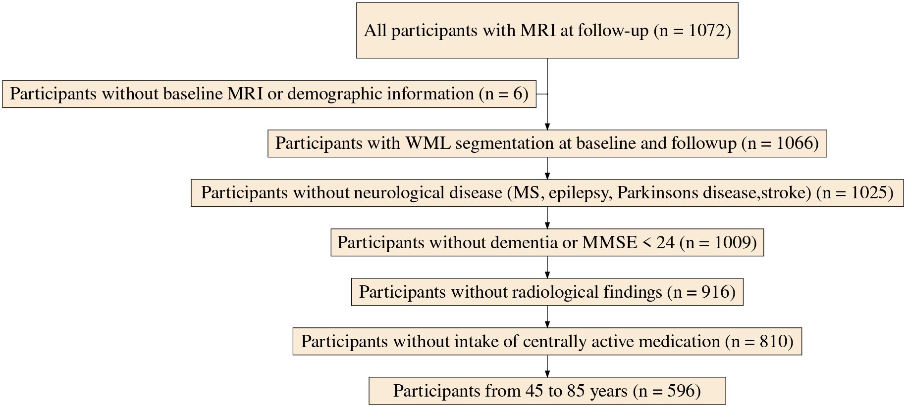
```


```{r create studytable, echo=FALSE}
miceadds::load.Rdata(objname = "imp", "/data/pt_life_whm/Results/VRF_cSVD/imputed_data/imputed_data_6.12.23/imputed_data_6.12.23.Rdata")
orig=imp$data
orig_show=orig[orig$time=="bl",c(3:5,7:10,21)]
orig_show$sex=as.factor(orig_show$sex)
levels(orig_show$sex)=c("female", "male")
levels(orig_show$education)=c("No tertiary education", "Tertiary education")
s=sumtable(orig_show,labels=c("Age (y)", "Gender", "Education", "DBP (mmHg)", "WHR", "CESD", "BP medication", "WMH volume (cm³)"), 
                summ=c('notNA(x)','mean(x)', 'sd(x)'),
           summ.names	=c("N", "Mean", "SD"),
           digits = 3,
           out="return",
           add.median=TRUE)
tf=flextable(s) 
tf <- set_header_labels(tf,
  values = list(
    Variable= "",
    N = "N",
    Mean = "Mean",
    SD = "SD")) #set_caption("Demographic characteristics of the 3C and LIFE-Adult samples")
tf <- align(tf, align = "center", part = "header")
tf <-  vline(tf, j=c(1), part = "all")%>%
   set_table_properties(layout = "autofit", width = .9)%>% set_caption("Baseline demographic characteristics of participants included in the study")

```

```{r studytable, out.width="95%", results='show',caption="Baseline demographic characteristics of participants included in the study."}
tf 
```

## Confirmatory analyses

### H1: Baseline DBP and WMH progression

```{r tabM1CRVfreq, eval=FALSE}
res=read.csv(paste0(outdir_conf, "M1_VRF_model_res_freq.csv"))
res_table=
res %>%
#   mutate(
#     adj.p = cell_spec(adj.p, "latex", bold = ifelse(adj.p < 0.05, T, F))
#   )  %>%
  #select(p_adjust) %>%
  kable() %>%
  kable_styling(bootstrap_options = c("striped", "hover"))
res_table
```

```{r forestM1_CRV_freq, echo=FALSE}
model="M1_VRF"
wd=outdir_conf
load(paste0(wd,"workspace_",model,"_freq_imp_res.RData"))
fp=mice::pool(res)
fp_for_text_m1=summary(fp)
cm <- c('age_base'    = 'Age at baseline',
        'age_change'    = 'Time',
        "DBP_base" = "Baseline DBP",
        "DBP_change" = "DBP change",
        "WHR_base" = "Baseline WHR",
        "WHR_change" = "WHR change",
        "age_change:DBP_base" = "DBP x Time",
        "age_change:WHR_base" = "WHR x Time")
        
# "sex" = "Gender (males=1)",
#         "BPmed1" = "Intake of BP medication",
#         "TIV" = "Total intracranial volume",
# '(Intercept)' = 'Constant')

tab<-modelsummary(
  fp,
  fmt = 3,
  shape = term ~ model + statistic,
  estimate  = "{estimate} [{conf.low}, {conf.high}]",
  statistic = "{p.value}",
  coef_omit = "Intercept", 
  coef_map = cm,
  output = 'flextable',
  gof_omit = 'Num.Obs.|Num.Imp.')

ref_table <- data.frame(
  key = c(" ","(1) / Est.","(1) / p"),
  label = c("", "Estimate [95 % CI]", "p-value")
)

tab=tab %>% set_caption("Results of Model M1 testing the association of baseline DBP with WMH progression")%>% set_header_df(mapping = ref_table, key = "key")%>% autofit()
   
```

```{r M1CRVres, results='show', echo=FALSE}
tab
```

```{r plotM1_CRV_forest, echo=FALSE}
modelplot(fp, coef_omit = 'Intercept', coef_map=cm, size = 0.5, fatten = .7, color = 'black', linetype = 'solid') + theme_bw(base_size=13)
ggsave(paste0(wd, "Model1_VRF_forest.png"))
```

```{r showM1CRVforest, echo=FALSE, out.width="95%", fig.align = "center", fig.cap="Results from CVR and WMH progression model", results="show"}
knitr::include_graphics(paste0(wd, "Model1_VRF_forest.png"))
```

```{r plotM1_CRV_asso, echo=FALSE}
p1<-comp_plot("M1_VRF","age_change:DBP_base", dir=outdir_conf, impdata=impdata)
p2<-comp_plot("M1_VRF","DBP_change", dir=outdir_conf, impdata=impdata)
p3<-comp_plot("M1_VRF","age_change:WHR_base", dir=outdir_conf, impdata=impdata)
p4<-comp_plot("M1_VRF","WHR_change", dir=outdir_conf, impdata=impdata)

plots=grid.arrange(p1[[1]],p2[[1]],p3[[1]],p4[[1]], layout_matrix = cbind(c(1,3),c(1,3),c(1,3), c(2,4),c(2,4)))


ggsave(
  "figures/Model1_VRF_scatter.png", 
  plots, 
  device = agg_png, 
  width = 20, height = 10, units = "cm", res = 300,
  scaling = 1
)
```

```{r showM1CRVasso, echo=FALSE, out.width="95%", fig.align = "center", fig.cap="Results from M1 on the association of DBP and WHR and WMH progression model. Shown are scatter plots for associations of baseline and change in CVR factors with WMH volume. The pizza chart illustrates the Bayes factor in favour of the alternative hypothesis.", fig.show='asis', results='asis'}
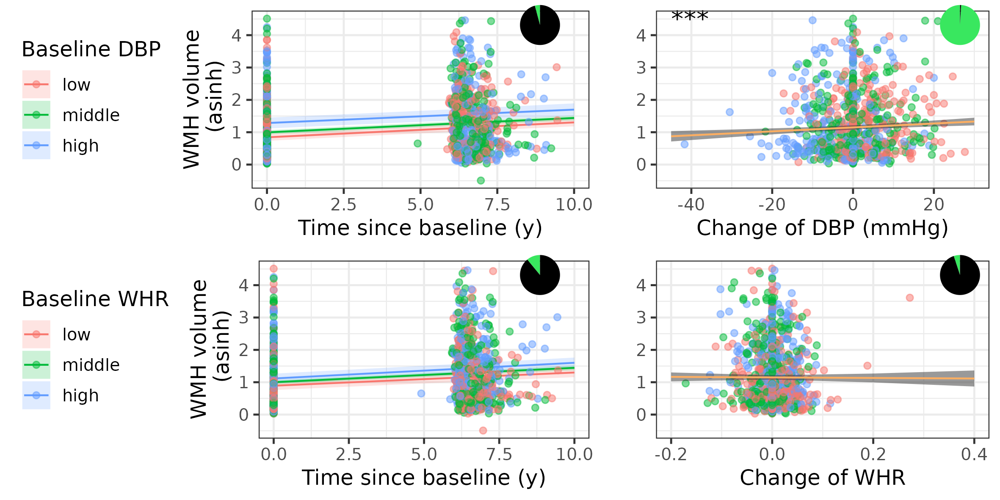
```

```{r include M1 BF}
model="M1_VRF"
wd=outdir_conf
bf=read.csv(paste0(wd,model,"_model_res_bayes.csv"))
bf$pred=c("age_change:WHR_base", "age_change:DBP_base", "WHR_change", "DBP_change")


wald=read.csv(paste0('/data/pt_life_whm/Results/VRF_cSVD/LME/results/Conf/workspace_',model, '_freq_imp_res_d1_DBP_baseline.csv'))
```

In model M1, we tested whether higher baseline DBP was associated with stronger WMH progression over time. There was no interaction of baseline DBP and time (one-sided corrected p-value = `r round(2/3*fp_for_text_m1[fp_for_text_m1$term=="age_change:DBP_base", "p.value"],2)` and BF = `r round(bf[bf$pred=="age_change:DBP_base","mean_one_sided_bf"], 2)` with moderate evidence against this hypothesis. The multivariate Wald test comparing a model with and without the interaction of baseline DBP and time, pooled across multiple imputations, yielded a p-value of `r round(2/3*wald[1,"P..F."],2)`. Table \@ref(tab:M1CRVres) shows two-sided uncorrected p-values for all CVR factors.  \
Figure \@ref(fig:showM1CRVasso) shows the scatter plot and Bayes factor representations.

#### H2: WMH progression and executive function 

```{r tabM2exec, eval=FALSE}
res=read.csv(paste0(outdir_conf,"M2_exfunct_model_res_freq.csv"))
res_table=
res %>%
#   mutate(
#     adj.p = cell_spec(adj.p, "latex", bold = ifelse(adj.p < 0.05, T, F))
#   )  %>%
  #select(p_adjust) %>%
  kable() %>%
  kable_styling(bootstrap_options = c("striped", "hover"))
res_table
```

```{r forestM2_exfunct_freq, echo=FALSE}
model="M2_exfunct"
wd=outdir_conf
load(paste0(wd,"workspace_",model,"_freq_imp_res.RData"))
fp=mice::pool(res)
fp_for_text_ex=summary(fp)
cm <- c('age_base'    = 'Age at baseline',
        'age_change'    = 'Time',
        "asinh_wml_base" = "Baseline WMH volume",
        "asinh_wml_change" = "Change in WMH volume"
        )
tab<-modelsummary(
  fp,
  fmt = 3,
  shape = term ~ model + statistic,
  estimate  = "{estimate} [{conf.low}, {conf.high}]",
  statistic = "{p.value}",
  coef_omit = "Intercept", 
  coef_map = cm,
  output = 'flextable',
  gof_omit = 'Num.Obs.|Num.Imp.')

ref_table <- data.frame(
  key = c(" ","(1) / Est.","(1) / p"),
  label = c("", "Estimate [95 % CI]", "p-value")
)

tab=tab %>% set_caption("Association of WMH progression and executive function")%>% set_header_df(mapping = ref_table, key = "key")%>% autofit()
   
```

```{r M2exfunctres, results='show', echo=FALSE}
tab
```

```{r plotM2_exfunct_forest, echo=FALSE}
modelplot(fp, coef_omit = 'Intercept', coef_map=cm, size = 0.5, fatten = .7, color = 'black', linetype = 'solid') 
ggsave("figures/Model2_exfunc_forest.png")
```

```{r showM2exfunctforest, echo=FALSE, out.width="95%", fig.align = "center", fig.cap="Results from WMH progression and executive function model"}
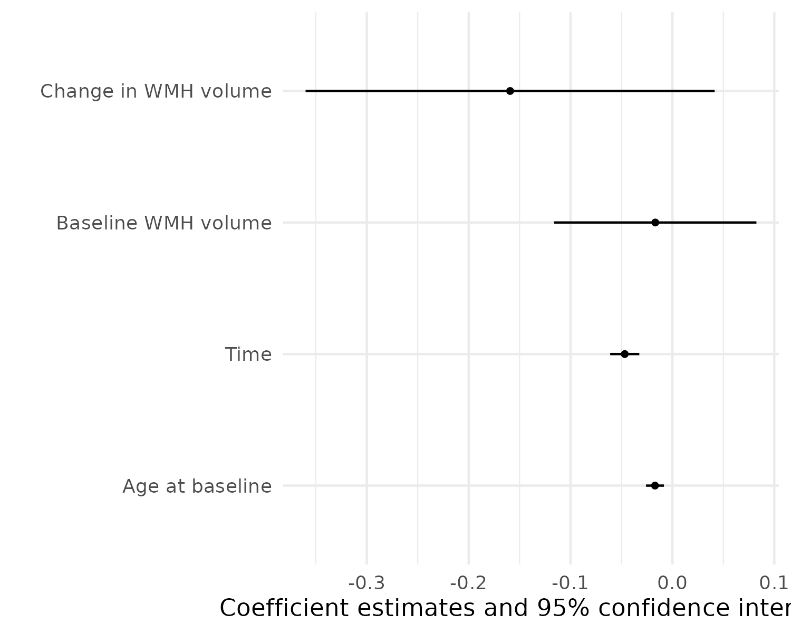
```

```{r tabM2execbf, echo=FALSE}
res=read.csv(paste0(outdir_conf, "M2_exfunct_model_res_bayes.csv"))
res_table=
res %>%
#   mutate(
#     adj.p = cell_spec(adj.p, "latex", bold = ifelse(adj.p < 0.05, T, F))
#   )  %>%
  #select(p_adjust) %>%
  kable() %>%
  kable_styling(bootstrap_options = c("striped", "hover"))
res_table
```

```{r plotM2_exfunct_asso, echo=FALSE}
p2<-comp_plot("M2_exfunct","asinh_wml_change", dir=outdir_conf, impdata=impdata)
plist<-comp_plot("M2_exfunct","asinh_wml_base", dir=outdir_conf, impdata=impdata)
mylegend<-g_legend(plist[[2]])

pcomb=ggdraw(plist[[2]] + theme(legend.position="none"))
pcomb=pcomb+draw_plot(plist[[3]],x=0.8, y=0.8, width=.2, height=.2)

p3 <- grid.arrange(arrangeGrob(pcomb,p2 + theme(legend.position="none"),
                         nrow=1),
             mylegend, nrow=2,heights=c(10, 1))


ggsave(
  "figures/Model2_exfunct_scatter.png", 
  p3, 
  device = agg_png, 
  width = 20, height = 10, units = "cm", res = 300,
  scaling = 1
)
```

```{r showM2exfunctasso, echo=FALSE, out.width="95%", fig.align = "center", fig.show='asis', results='asis', fig.cap="Results from M2 associating WMH progression and executive function. Shown are scatter plots for associations of baseline and change in CVR factors with WMH volume. The pizza chart illustrates the Bayes factor in favour of the alternative hypothesis."}
knitr::include_graphics(paste0(wd, "Model2_exfunct_scatter.png"))
```

```{r include M2 BF}
model="M2_exfunct"
wd=outdir_conf
bf=read.csv(paste0(wd,model,"_model_res_bayes.csv"))


wald=read.csv(paste0(outdir_conf,'/workspace_',model, '_freq_imp_res_d1_asinh_wml_change.csv'))
```

In model M2, we investigated the association of higher WMH progression and executive function. There was no association of change in WMH volume with executive function (change in WMH volume: est(sd) = `r round(fp_for_text_ex[fp_for_text_ex$term=="asinh_wml_change", "estimate"],2)`(`r round(fp_for_text_ex[fp_for_text_ex$term=="asinh_wml_change", "std.error"],2)`), corrected one-sided p-value = `r round(2/3*fp_for_text_ex[fp_for_text_ex$term=="asinh_wml_change", "p.value"],2)` and BF = `r round(bf[bf$pred=="asinh_wml_change","mean_one_sided_bf"], 2)` (see Table \@ref(tab:M2exfunctres)). The multivariate Wald test comparing a model with and without the change in WMH volume, pooled across multiple imputations, yielded a p-value of `r round(2/3*wald[1,"P..F."],2)`. Based on the BF between 0.3 and 3, these results are inconclusive.\
Figure \@ref(fig:showM2exfunctasso) shows the scatter plots of the associations. 

#### H3: WMH progression and global cognitive function 
With Model 3 we investigated the association of higher WMH progression and global cognitive function. 

```{r tabM3globalcogfreq, eval=FALSE}
res=read.csv(paste0(outdir_conf, "M2_exfunct_model_res_freq.csv"))
res_table=
res %>%
#   mutate(
#     adj.p = cell_spec(adj.p, "latex", bold = ifelse(adj.p < 0.05, T, F))
#   )  %>%
  #select(p_adjust) %>%
  kable() %>%
  kable_styling(bootstrap_options = c("striped", "hover"))
res_table
```

```{r tabM3globalcogbf, eval=FALSE}
res=read.csv(paste0(outdir_conf, "M2_exfunct_model_res_bayes.csv"))
res_table=
res %>%
#   mutate(
#     adj.p = cell_spec(adj.p, "latex", bold = ifelse(adj.p < 0.05, T, F))
#   )  %>%
  #select(p_adjust) %>%
  kable() %>%
  kable_styling(bootstrap_options = c("striped", "hover"))
res_table
```

```{r forestM3_globalcog_forest, echo=FALSE}
model="M3_globalcog"
wd=outdir_conf
load(paste0(wd,"workspace_",model,"_freq_imp_res.RData"))
fp=mice::pool(res)
fp_for_text_gc=summary(fp)
cm <- c('age_base'    = 'Age at baseline',
        'age_change'    = 'Time',
        "asinh_wml_base" = "Baseline WMH volume",
        "asinh_wml_change" = "Change in WMH volume"
        )
tab<-modelsummary(
  fp,
  fmt = 3,
  shape = term ~ model + statistic,
  estimate  = "{estimate} [{conf.low}, {conf.high}]",
  statistic = "{p.value}",
  coef_omit = "Intercept", 
  coef_map = cm,
  output = 'flextable',
  gof_omit = 'Num.Obs.|Num.Imp.')

ref_table <- data.frame(
  key = c(" ","(1) / Est.","(1) / p"),
  label = c("", "Estimate [95 % CI]", "p-value")
)

tab=tab %>% set_caption("Association of WMH progression and global cognitive function")%>% set_header_df(mapping = ref_table, key = "key")%>% autofit()
   
```

```{r M3globcogres, results='show', echo=FALSE}
tab
```

```{r plotM3_gc_forest, echo=FALSE}
modelplot(fp, coef_omit = 'Intercept', coef_map=cm, size = 0.5, fatten = .7, color = 'black', linetype = 'solid') 
ggsave("figures/M3_globalcog_forest.png")
```

```{r showM3gcforest, echo=FALSE, out.width="95%", fig.align = "center", fig.cap="Results from M3 associating WMH progression and global cognitive function. Shown are scatter plots for associations of baseline and change in CVR factors with WMH volume. The pizza chart illustrates the Bayes factor in favour of the alternative hypothesis."}
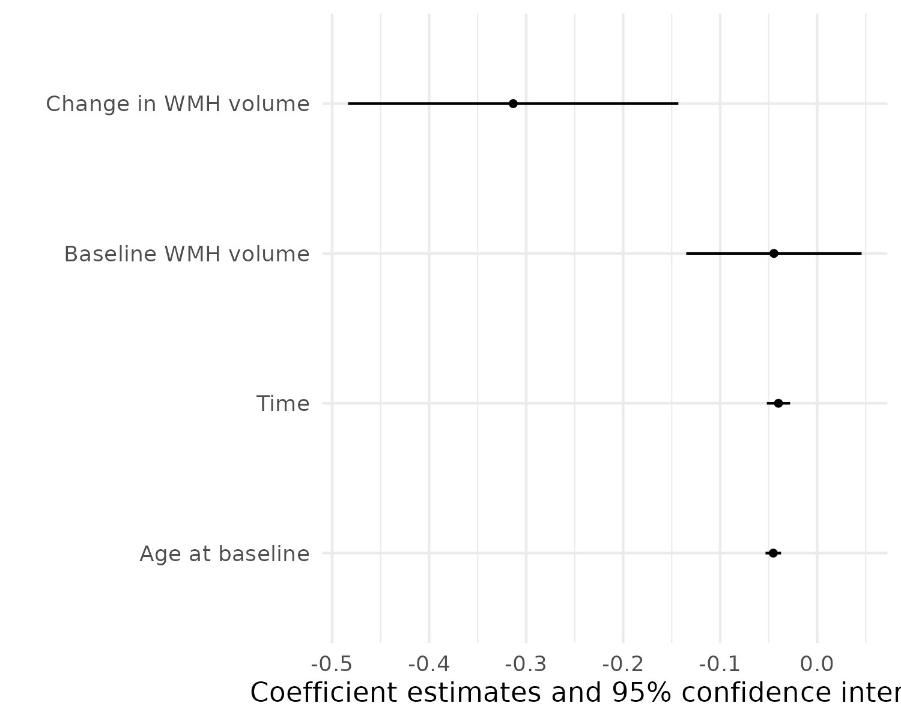
```

```{r plotM3_globalcog, echo=FALSE}
p2<-comp_plot("M3_globalcog","asinh_wml_change", dir=outdir_conf, impdata=impdata)
plist<-comp_plot("M3_globalcog","asinh_wml_base", dir=outdir_conf, impdata=impdata)
mylegend<-g_legend(plist[[2]])

pcomb=ggdraw(plist[[2]] + theme(legend.position="none"))
pcomb=pcomb+draw_plot(plist[[3]],x=0.8, y=0.8, width=.2, height=.2)

p3 <- grid.arrange(arrangeGrob(pcomb,p2[[1]] + theme(legend.position="none"),
                         nrow=1),
             mylegend, nrow=2,heights=c(10, 1))


ggsave(
  "figures/M3_globalcog_scatter.png", 
  p3, 
  device = agg_png, 
  width = 20, height = 10, units = "cm", res = 300,
  scaling = 1
)
```

```{r showM3gcasso, echo=FALSE, out.width="95%", fig.align = "center", fig.cap="Results from WMH progression and executive function model", fig.show='asis', results='show'}
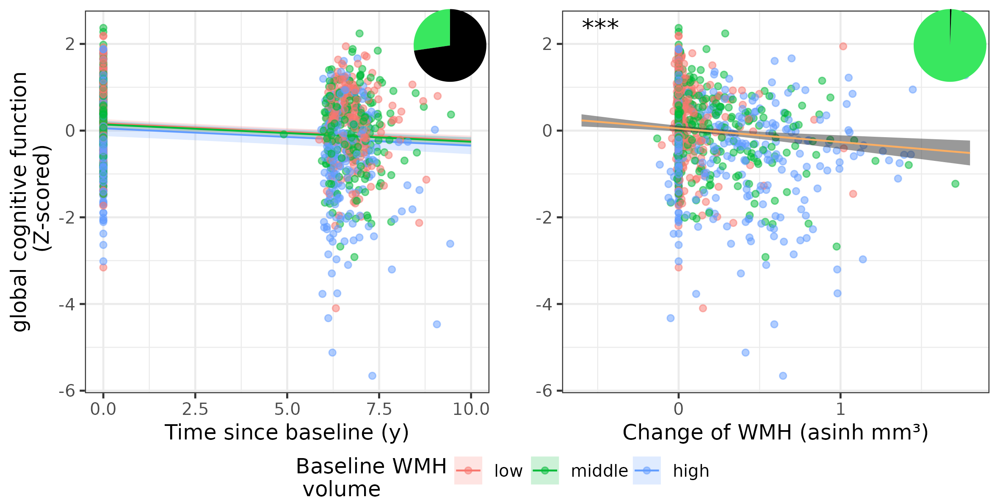
```

```{r include M3 gc}
model="M3_globalcog"
wd=outdir_conf
bf=read.csv(paste0(wd,model,"_model_res_bayes.csv"))

wald=read.csv(paste0('/data/pt_life_whm/Results/VRF_cSVD/LME/results/Conf/workspace_',model, '_freq_imp_res_d1_asinh_wml_change.csv'))
```

In model M3, we investigated the association of higher WMH progression and global cognition. Change in WMH volume was associated with stronger decline in global cognition (est(sd) = `r round(fp_for_text_gc[fp_for_text_gc$term=="asinh_wml_change", "estimate"],2)`(`r round(fp_for_text_gc[fp_for_text_gc$term=="asinh_wml_change", "std.error"],2)`), corrected one-sided p-value = `r round(2/3*fp_for_text_gc[fp_for_text_gc$term=="asinh_wml_change", "p.value"],4)` and BF = `r round(bf[bf$pred=="asinh_wml_change","mean_one_sided_bf"], 2)`). The multivariate Wald test comparing a model with and without the change in WMH volume, pooled across multiple imputations, yielded a p-value of `r round(2/3*wald[1,"P..F."],2)`. Table \@ref(tab:M3globcogres)) shows uncorrected two-sided p-values and Figure \@ref(fig:showM3gcasso) shows the scatter plots of the associations. 
```{r tmp, eval=F}
There was no association of baseline WMH volume with global cognition (est(sd) = `r round(fp_for_text[fp_for_text$term=="asinh_wml_base", "estimate"],2)`(`r round(fp_for_text[fp_for_text$term=="asinh_wml_base", "std.error"],2)`), p-value = `r round(fp_for_text[fp_for_text$term=="asinh_wml_base", "p.value"],2)` and BF = `r round(bf[bf$pred=="asinh_wml_base","mean_one_sided_bf"], 2)`), yet
```


### Exploratory Analyses
#### E1a-E1c (DBP change, WHR baseline, WHR change)
We hypothesized that higher WHR at baseline, and increases in WHR and DBP would be associated with stronger increase of WMH volume over time.\
```{r bf m1}
model="M1_VRF"
wd=outdir_conf
bf=read.csv(paste0(wd,model,"_model_res_bayes.csv"))
bf$pred=c("age_change:WHR_base", "age_change:DBP_base", "WHR_change", "DBP_change")
```

We used model 1 for exploring these associations. We found that higher change in DBP was associated with stronger progression of WML volume (est(sd) = `r round(fp_for_text_m1[fp_for_text_m1$term=="DBP_change", "estimate"],3)` (`r round(fp_for_text_m1[fp_for_text_m1$term=="DBP_change", "std.error"],3)`), p-value = `r round(fp_for_text_m1[fp_for_text_m1$term=="DBP_change", "p.value"],5)` and BF = `r round(bf[bf$pred=="DBP_change","mean_one_sided_bf"], 2)`. There were no significant associations for WHR change or the interaction of age and WHR (see Table \@ref(tab:M1CRVres)). 

#### E2a - E3b: Interactions of gender, CVR risk, WMH progression and cognition
While men had significantly lower WMH volume at baseline (est(sd) = `r round(fp_for_text_m1[fp_for_text_m1$term=="sex", "estimate"],2)` (`r round(fp_for_text_m1[fp_for_text_m1$term=="sex", "std.error"],2)`), p-value = `r round(fp_for_text_m1[fp_for_text_m1$term=="sex", "p.value"],3)`, there was no significant interaction of gender and WMH progression, gender and DBP change on WMH progression or any interaction with DBP or WHR at baseline and WHR change. 
Women performed better in executive function (est(se) = `r round(fp_for_text_ex[fp_for_text_ex$term=="sex", "estimate"],2)` (`r round(fp_for_text_ex[fp_for_text_ex$term=="sex", "std.error"],2)`), p-value = `r round(fp_for_text_ex[fp_for_text_ex$term=="sex", "p.value"],3)`) and global cognitive function (est(se) = `r round(fp_for_text_gc[fp_for_text_gc$term=="sex", "estimate"],2)` (`r round(fp_for_text_gc[fp_for_text_gc$term=="sex", "std.error"],2)`), p-value = `r round(fp_for_text_gc[fp_for_text_gc$term=="sex", "p.value"],3)`) than men. \
There was no significant interaction of gender and change in WMH volume on executive function or global cognitive function change (see supplements and Tables \@ref(tab:M1sexstr), \@ref(tab:E2sexstr) and \@ref(tab:E3sexstr) for gender-stratified results).

```{r M1sexstratified, results='show', echo=FALSE}
load(paste0(outdir_expl, "/workspace_M1_VRF_0_freq_imp_res.RData"))
resf=res
load(paste0(outdir_expl, "/workspace_M1_VRF_1_freq_imp_res.RData"))
resm=res

fpf=mice::pool(resf)
fpm=mice::pool(resm)
cm <- c('age_base'    = 'Age at baseline',
        'age_change'    = 'Time',
        "DBP_base" = "Baseline DBP",
        "DBP_change" = "DBP change",
        "WHR_base" = "Baseline WHR",
        "WHR_change" = "WHR change",
        "age_change:DBP_base" = "DBP x Time",
        "age_change:WHR_base" = "WHR x Time")
tab<-modelsummary(
  list(fpf, fpm),
  fmt = 3,
  shape = term ~ model + statistic,
  estimate  = "{estimate} [{conf.low}, {conf.high}]",
  statistic = "{p.value}",
  coef_omit = "Intercept", 
  coef_map = cm,
  output = 'flextable',
  gof_omit = 'Num.Obs.|Num.Imp.')

ref_table <- data.frame(
  key = c(" ","(1) / Est.","(1) / p","(2) / Est.","(2) / p"),
  label = c("", "Females: Estimate \n[95 % CI]", "Females:\np-value",
            "Males: Estimate \n[95 % CI]", "Males:\np-value")
)

tab=tab %>% set_caption("Gender-stratified results for Model M1 on CVR factors")%>% set_header_df(mapping = ref_table, key = "key")%>%   set_table_properties(layout = "autofit", width = .8)

```
```{r M1sexstr, results='show', echo=FALSE}
tab
```


```{r M2sexstratified, results='show', echo=FALSE}
load(paste0(outdir_expl, "/workspace_M2_exfunct_0_freq_imp_res.RData"))
resf=res
load(paste0(outdir_expl, "/workspace_M2_exfunct_1_freq_imp_res.RData"))
resm=res

fpf=mice::pool(resf)
fpm=mice::pool(resm)
cm <- c('age_base'    = 'Age at baseline',
        'age_change'    = 'Time',
        "asinh_wml_base" = "Baseline WMH volume",
        "asinh_wml_change" = "Change in WMH volume"
        )
tab<-modelsummary(
  list(fpf, fpm),
  fmt = 3,
  shape = term ~ model + statistic,
  estimate  = "{estimate} [{conf.low}, {conf.high}]",
  statistic = "{p.value}",
  coef_omit = "Intercept", 
  coef_map = cm,
  output = 'flextable',
  gof_omit = 'Num.Obs.|Num.Imp.')

ref_table <- data.frame(
  key = c(" ","(1) / Est.","(1) / p","(2) / Est.","(2) / p"),
  label = c("", "Females: Estimate \n[95 % CI]", "Females:\np-value",
            "Males: Estimate \n[95 % CI]", "Males:\np-value")
)

tab=tab %>% set_caption("Gender-stratified results for Model M2 on executive function")%>% set_header_df(mapping = ref_table, key = "key")%>%
  set_table_properties(layout = "autofit", width = .8)

```
```{r E2sexstr, results='show', echo=FALSE}
tab
```

```{r M3sexstratified, results='show', echo=FALSE}
load(paste0(outdir_expl, "/workspace_M3_globalcog_0_freq_imp_res.RData"))
resf=res
load(paste0(outdir_expl, "/workspace_M3_globalcog_1_freq_imp_res.RData"))
resm=res

fpf=mice::pool(resf)
fpm=mice::pool(resm)
cm <- c('age_base'    = 'Age at baseline',
        'age_change'    = 'Time',
        "asinh_wml_base" = "WMH volume baseline",
        "asinh_wml_change" = "Change in WMH volume"
        )
tab<-modelsummary(
  list(fpf, fpm),
  fmt = 3,
  shape = term ~ model + statistic,
  estimate  = "{estimate} [{conf.low}, {conf.high}]",
  statistic = "{p.value}",
  coef_omit = "Intercept", 
  coef_map = cm,
  output = 'flextable',
  gof_omit = 'Num.Obs.|Num.Imp.')

ref_table <- data.frame(
  key = c(" ","(1) / Est.","(1) / p","(2) / Est.","(2) / p"),
  label = c("", "Females: Estimate \n[95 % CI]", "Females:\np-value",
            "Males: Estimate \n[95 % CI]", "Males:\np-value")
)

tab=tab %>% set_caption("Gender-stratified results for Model M3 on global cognitive function")%>% set_header_df(mapping = ref_table, key = "key")%>%   set_table_properties(layout = "autofit", width = .8)

```
```{r E3sexstr, results='show', echo=FALSE}
tab
```
### E4: Association of SBP and WMH progression

```{r resSBPfreq, results='show', echo=FALSE}
load(paste0(outdir_expl, '/SBP_model_res.Rdata'))
fp=mice::pool(res)
fp_for_text_m1=summary(fp)
cm <- c('age_base'    = 'Age at baseline',
        'age_change'    = 'Time between baseline and followup',
        "SBP_base" = "Systolic BP at baseline",
        "SBP_change" = "Change in Systolic BP",
        "WHR_base" = "Waist-to-hip ratio at baseline",
        "WHR_change" = "Change in WHR",
        "age_change:SBP_base" = "Interaction of time and SBP at baseline",
        "age_change:WHR_base" = "Interaction of time and WHR at baseline")
        
# "sex" = "Gender (males=1)",
#         "BPmed1" = "Intake of BP medication",
#         "TIV" = "Total intracranial volume",
# '(Intercept)' = 'Constant')

tab<-modelsummary(
  fp,
  fmt = 4,
  shape = term ~ model + statistic,
  estimate  = "{estimate} [{conf.low}, {conf.high}]",
  statistic = "{p.value}",
  coef_omit = "Intercept", 
  coef_map = cm,
  output = 'flextable',
  gof_omit = 'Num.Obs.|Num.Imp.')

ref_table <- data.frame(
  key = c(" ","(1) / Est.","(1) / p"),
  label = c("", "Estimate [95 % CI]", "p-value")
)

tab %>% set_caption("Results of an exploratory model testing the association of baseline and change in SBP with WMH progression")%>% set_header_df(mapping = ref_table, key = "key")%>% autofit()
   
d1=read.csv(paste0(outdir_expl, '/SBP_model_res_d1.csv'))

```

We also explored the association of SBP at baseline, change of SBP and WMH progression and found that baseline SBP predicted WMH progression (est(se) = `r round(fp_for_text_m1[fp_for_text_m1$term=="age_change:SBP_base", "estimate"],5)` (`r round(fp_for_text_m1[fp_for_text_m1$term=="age_change:SBP_base", "std.error"],5)`), p-value = `r round(fp_for_text_m1[fp_for_text_m1$term=="age_change:SBP_base", "p.value"],3)`), Wald p-value = `r round(d1[1,"P..F."],2)`, see Table \@ref(tab:resSBPfreq)). Similar to DBP change, SBP change was also associated with WMH progression (est(se) = `r round(fp_for_text_m1[fp_for_text_m1$term=="SBP_change", "estimate"],2)` (`r round(fp_for_text_m1[fp_for_text_m1$term=="SBP_change", "std.error"],2)`), p-value = `r round(fp_for_text_m1[fp_for_text_m1$term=="SBP_change", "p.value"],3)`). 

### E5: Spatial patterns of WMH progression
We found that WMH progression was most pronounced in the frontal and parietal WM, especially in the deeper layers (see Figure \@ref(fig:spatialWMHprogr)). \
```{r spatialWMHprogr, echo=FALSE,out.width="90%",out.height="80%",fig.cap="Average WMH volume increase in Bullseye WM regions.",fig.show='asis', results='show',fig.align='center'}
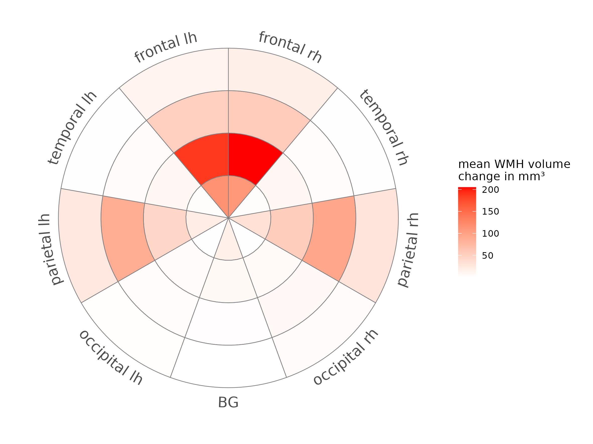
```

We derived four spatial patterns of WMH, shown in Figure \@ref(fig:spatialWMHprogr)). Component 1 included occipital periventricular WMH, component 2 was composed of WMH in deeper layers of frontal, temporal and parietal lobe as well as basal ganglia. Component 3 included frontal and basal ganglia periventricular WMH and component 4 mainly included deep occipital WMH.

```{r BEbaselinepattern, echo=FALSE,out.width="90%",out.height="80%",fig.cap="WMH spatial pattern derived from baseline WMH distribution. Red color indicated stronger contribution of this region to the pattern.",fig.show='asis', results='show',fig.align='center'}
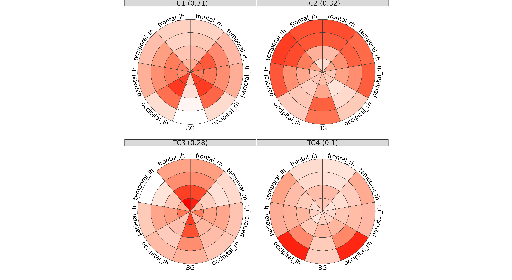
```

```{r run diff models}
miceadds::load.Rdata(objname = "imp_bound", "/data/pt_life_whm/Results/VRF_cSVD/imputed_data/imputed_data_withWMHcomponents/imputed_data_withWMHcomponents.Rdata")
library(ggpmisc)

changescore=ggplot(aes(x=age_change, y=value), 
       data=imp_bound$data%>%pivot_longer(cols=(C1:C4), names_to = "comp", values_to = "value" )) + geom_point(aes(color=time)) + 
  geom_point(imp_bound$data%>%pivot_longer(cols=(C1:C4), names_to = "comp", values_to = "value" ) %>% group_by(comp, time) %>% summarise(mean=mean(value, na.rm=T),                                                                    age_change=mean(age_change)), 
             mapping=aes(x=age_change, group=time, y = mean), 
            size=4)+ 
  geom_line(imp_bound$data%>%pivot_longer(cols=(C1:C4), names_to = "comp", values_to = "value") %>% group_by(comp, time) %>% summarise(mean=mean(value, na.rm=T),                                                                    age_change=mean(age_change)), 
            mapping=aes(x=age_change, group=1, y=mean), col=5)+
  facet_wrap(vars(comp))+ ylim(c(-2,3))+
  xlab("Age since baseline in years")+
  ylab("Individual component score")+
  theme(axis.text.x = element_text(color = "grey20", size = 24, angle=90, family = "Roboto"),
        axis.text.y = element_text(color = "grey20", size = 24, family = "Roboto"),
        axis.title.x = element_text(color = "grey20", size = 24, family = "Roboto"),
        axis.title.y = element_text(color = "grey20", size = 24, family = "Roboto"),
        legend.title = element_text(color = "grey20", size = 19, family = "Roboto"),
        legend.position = "none",
        strip.text.x = element_text(color = "grey20", size = 19, family = "Roboto"),
        legend.text = element_text(color = "grey20", size = 17, family = "Roboto"),
        plot.margin = margin(t = 0,  # Top margin
                             r = 0,  # Right margin
                             b = 0,  # Bottom margin
                             l = 0,  # Left margin
                             unit = "cm"))

ggsave(changescore,file="figures/Change_compscores.png", width=29, height=17, unit="cm", dpi=400)

diffC3 <- summary(pool(with(imp_bound, lmerTest::lmer(formula = 'C3 ~ age_change + TIV + (1|subj)'),
            REML=F, na.action = na.omit)))
diffC1 <- summary(pool(with(imp_bound, lmerTest::lmer(formula = 'C1 ~ age_change + TIV + (1|subj)'),
               REML=F, na.action = na.omit)))
diffC2 <- summary(pool(with(imp_bound, lmerTest::lmer(formula = 'C2 ~ age_change + TIV + (1|subj)'),
               REML=F, na.action = na.omit)))
diffC4 <- summary(pool(with(imp_bound, lmerTest::lmer(formula = 'C4 ~ age_change + TIV + (1|subj)'),
               REML=F, na.action = na.omit)))


```

```{r ChangeComps, echo=FALSE,out.width="90%",out.height="80%",fig.cap="WMH spatial pattern derived from baseline WMH distribution. Red color indicated stronger contribution of this region to the pattern.",fig.show='asis', results='asis',fig.align='center'}
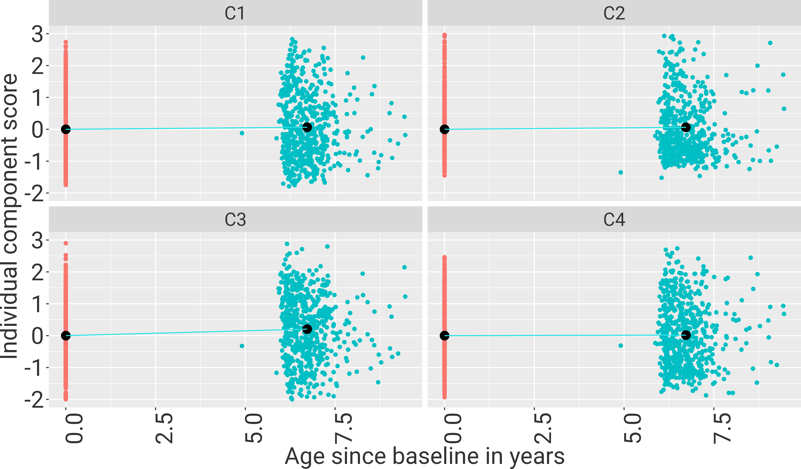
```

```{r M1_components, cache=T}
## Calc M1 with C3/C5
resC=list()
i=1

for (comp in c(paste0("C", seq(1:4)))){
  
  resC[[i]] <-pool(with(imp_bound, lmerTest::lmer(formula=paste0(comp,'~ age_base + age_change + 
                                 DBP_base + age_change:DBP_base + DBP_change  + 
                                 WHR_base + WHR_base:age_change + WHR_change +
                                    BPmed + TIV + (1|subj)'),
                                        REML=F, na.action = na.omit)))
 

  i=i+1
}

cm <- c('age_base'    = 'Age at baseline',
        'age_change'    = 'Time',
        "DBP_base" = "Baseline DBP",
        "DBP_change" = "DBP change",
        "WHR_base" = "Baseline WHR",
        "WHR_change" = "WHR change",
        "age_change:DBP_base" = "DBP x Time",
        "age_change:WHR_base" = "WHR x Time")
        
tab<-modelsummary(
  list(resC[[1]], resC[[2]],resC[[3]], resC[[4]]),
  fmt = 3,
  shape = term ~ model + statistic,
  estimate  = "{estimate} [{conf.low}, {conf.high}]",
  statistic = "{p.value}",
  coef_omit = "Intercept", 
  coef_map = cm,
  output = 'flextable',
  gof_omit = 'Num.Obs.|Num.Imp.')

ref_table <- data.frame(
  key = c(" ","(1) / Est.","(1) / p","(2) / Est.","(2) / p",
          "(3) / Est.","(3) / p","(4) / Est.","(4) / p"
  ),
  label = c("", "C1: Estimate \n[95 % CI]", "C1:\np-value",
            "C2: Estimate \n[95 % CI]", "C2:\np-value", 
            "C3: Estimate \n[95 % CI]", "C3:\np-value",
            "C4: Estimate \n[95 % CI]", "C4:\np-value"))

tab=tab %>% set_caption("Associations of DBP and WHR with progression of spatial WMH components") %>% set_header_df(mapping = ref_table, key = "key")%>%
  set_table_properties(layout = "autofit")

sc3=summary(resC[[3]])

```
```{r M1WMHcomponents, results='show', echo=FALSE}
tab
```

In Model M1, only component 3 was associated with an increase in DBP (est(sd) = `r round(sc3[sc3$term=="DBP_change", "estimate"],4)`(`r round(sc3[sc3$term=="DBP_change", "std.error"],4)`), p-value = `r round(sc3[sc3$term=="DBP_change", "p.value"],5)`) \. All components were cross-sectionally associated with age and only component 3 also increased over time independently of DBP (see Table \@ref(tab:M1WMHcomponents)).

```{r GC_components, cache=T}
## Calc M1 with C3/C5
resex=list()
resgc=list()
i=1

for (comp in c(paste0("C", seq(1:4)))){
  
  resex[[i]] <-pool(with(imp_bound, lmerTest::lmer(formula = paste0('exfunct ~ age_base + age_change + 
                                 c',i,'_base + c',i,'_change + 
                                  education + cesd + TIV +
                             (1|subj)'),REML=F, na.action = na.omit)))
  resgc[[i]] <-pool(with(imp_bound, lmerTest::lmer(formula = paste0('globalcog ~ age_base + age_change + 
                                 c',i,'_base + c',i,'_change + 
                                  education + cesd + TIV +
                             (1|subj)'),REML=F, na.action = na.omit)))
  i=i+1
  }

cm <- c('age_base'    = 'Age at baseline',
        'age_change'    = 'Time',
        "c1_base" = "Baseline component score",
        "c1_change" = "Change in component score",
        "c2_base" = "Baseline component score",
        "c2_change" = "Change in component score",
        "c3_base" = "Baseline component score",
        "c3_change" = "Change in component score",
        "c4_base" = "Baseline component score",
        "c4_change" = "Change in component score")
      
tab_ex<-modelsummary(
  list(resex[[1]], resex[[2]],resex[[3]], resex[[4]]),
  fmt = 3,
  shape = term ~ model + statistic,
  estimate  = "{estimate} [{conf.low}, {conf.high}]",
  statistic = "{p.value}",
  coef_omit = "Intercept", 
  coef_map = cm,
  output = 'flextable',
  gof_omit = 'Num.Obs.|Num.Imp.')  

tab<-modelsummary(
  list(resgc[[1]], resgc[[2]],resgc[[3]], resgc[[4]]),
  fmt = 3,
  shape = term ~ model + statistic,
  estimate  = "{estimate} [{conf.low}, {conf.high}]",
  statistic = "{p.value}",
  coef_omit = "Intercept", 
  coef_map = cm,
  output = 'flextable',
  gof_omit = 'Num.Obs.|Num.Imp.')

ref_table <- data.frame(
  key = tab$header$col_keys,
  label = c("", "C1: Estimate \n[95 % CI]", "C1:\np-value",
            "C2: Estimate \n[95 % CI]", "C2:\np-value", 
            "C3: Estimate \n[95 % CI]", "C3:\np-value",
            "C4: Estimate \n[95 % CI]", "C4:\np-value"))

tab=tab%>%set_caption("Associations of WMH spatial component progression with global cognitive function") %>% set_header_df(mapping = ref_table, key = "key")%>%
  set_table_properties(layout = "autofit", width = .8)

sgc=summary(resgc[[3]])
```

```{r M3WMHcomponents, results='show', echo=FALSE}
tab
```

```{r M2WMHcomponents, results='show', echo=FALSE, eval=F}
tab_ex %>% set_caption("Associations of WMH spatial component progression with executive function") %>% set_header_df(mapping = ref_table, key = "key")%>%
  set_table_properties(layout = "autofit", width = .8)
```

We found that increases in C1 were significantly associated with increased decline in global cognitive function (est(sd) = `r round(sgc[sgc$term=="c3_change", "estimate"],3)`(`r round(sgc[sgc$term=="c3_change", "std.error"],3)`), p-value = `r round(sgc[sgc$term=="c3_change", "p.value"],5)`)) (see \@ref(tab:M3WMHcomponents)). None of the components was associated with executive function decline.

### Model Assumptions
```{r model assumptions M1, eval=T, cache=F}
n_infl=list()
stall=list()
vrf_coefs=list()
rob=list()
conf=list()
for (i in c(1:5)){
  n_infl=rbind(n_infl,read.csv(paste0(outdir_assumptions, "model_M1_VRF/vrf_infl_cases_M1_VRF_imp_",i,".csv")))
  vrf_coefs=rbind(vrf_coefs,read.csv(paste0(outdir_assumptions, "model_M1_VRF/vrf_coeffs_wo_infl_M1_VRFimp_",i,".csv")))
  conf=rbind(conf,read.csv(paste0(outdir_assumptions, "model_M1_VRF/vrf_conf_M1_VRF_imp_",i,".csv")))
  stall=rbind(stall,read.csv(paste0(outdir_assumptions, "model_M1_VRF/vrf_stabmodel_M1_VRFimp_",i,".csv")))
  rob=rbind(rob, read.csv(paste0(outdir_assumptions, "model_M1_VRF/vrf_robustmodel_M1_VRFimp_",i,".csv")))
}

n_infl_m1=n_infl

#Summarize stability results (min max across imputations)
stall$imp=as.factor(rep(c(1:5), each=14))
stall_sum = stall%>%
  group_by(X) %>%  
  summarise(orig=mean(orig),
            min=min(min),
         max=max(max))

#create confidence intervals for results from influential cases
vrf_coefs$imp=as.factor(rep(c(1:5), each=12))
vrf_coefs = cbind(vrf_coefs, conf[c(3:14,17:28,31:42,45:56,59:70),])

rob_sum = rob%>%
  group_by(X) %>% 
  summarise(Estimate=mean(Estimate),
            min=min(X2.5..),
            max=max(X97.5..))

p<-ggplot(vrf_coefs[vrf_coefs$X=="age_change:DBP_base"|
                 vrf_coefs$X=="age_change:WHR_base"|
                 vrf_coefs$X=="DBP_change"|
                 vrf_coefs$X=="WHR_change",], aes(y = X, x = Estimate, xmin=X2.5.., xmax=X97.5..)) +
    geom_pointrange(aes(color = imp), size=0.1,  position = position_dodge(width = .5)) + 
  geom_pointrange(aes(x=Estimate, xmin=min, xmax=max, y=X), shape=17,size=0.3, color=c("darkred"), data=rob_sum[rob_sum$X=="age_change:DBP_base"|
                 rob_sum$X=="age_change:WHR_base"|
                 rob_sum$X=="DBP_change"|
                 rob_sum$X=="WHR_change",]) +
  geom_pointrange(aes(x=orig, xmin=min, xmax=max, y=X), size=0.3, color=c("grey20"), data=stall_sum[stall_sum$X=="age_change:DBP_base"|
                 stall_sum$X=="age_change:WHR_base"|
                 stall_sum$X=="DBP_change"|
                 stall_sum$X=="WHR_change",])+ 
  scale_y_discrete(labels=rev(c('WHR change', 'DBP change', 'Age x WHR', 'Age x DBP')))+
  theme(axis.text.x = element_text(color = "grey20", size = 17, angle=90, family = "Roboto"),
        axis.title.y = element_blank(),
        axis.title.x = element_text(color = "grey20", size = 17, family = "Roboto"),
        axis.text.y = element_text(color = "grey20", size = 17, family = "Roboto"),
        legend.title = element_text(color = "grey20", size = 17, family = "Roboto"),
        legend.text = element_text(color = "grey20", size = 17, family = "Roboto"),
        plot.margin = margin(t = 0,  # Top margin
                             r = 0,  # Right margin
                             b = 0,  # Bottom margin
                             l = 0,  # Left margin
                             unit = "cm"))
ggsave(
  "figures/Assumptions_M1.png", 
  p, 
  device = agg_png, 
  width = 10, height = 6, units = "cm", res = 300,
  scaling = 0.7
)
```

```{r showassuM1, echo=FALSE,out.width="90%",out.height="80%",fig.cap="Original estimate (black) with minimum and maximum estimate derived from random effect stability analysis (black line), estimate and 95% CI from robust LMM  and estimates and 95% CI without 13 influential cases (colours indicate imputation).",fig.show='asis', results='asis', fig.align='center'}
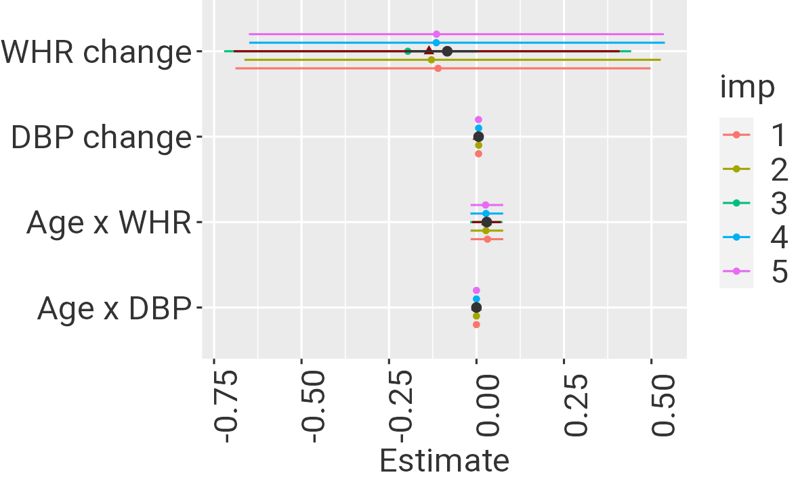
```

```{r model assumptions M2, eval=T, cache=T}
n_infl=list()
stall=list()
coefs=list()
conf=list()
rob=list()
for (i in c(1:5)){
  n_infl=rbind(n_infl,read.csv(paste0(outdir_assumptions, "model_M2_exfunct/infl_cases_M2_exfunct_imp_",i,".csv")))
  coefs=rbind(coefs,read.csv(paste0(outdir_assumptions, "model_M2_exfunct/coeffs_wo_infl_M2_exfunct_imp_",i,".csv")))
  conf=rbind(conf, read.csv(paste0(outdir_assumptions, "model_M2_exfunct/M2_exfunct_imp_",i,".csv")))
  stall=rbind(stall,read.csv(paste0(outdir_assumptions, "model_M2_exfunct/stabmodel_M2_exfunct_imp_",i,".csv")))
  rob=rbind(rob,read.csv(paste0(outdir_assumptions, "model_M2_exfunct/robustmodel_M2_exfunct_imp_",i,".csv")))
}
n_infl_ex=n_infl

#Summarize stability results (min max across imputations)
stall$imp=as.factor(rep(c(1:5), each=nrow(stall)/5))
stall_sum = stall%>%
  group_by(X) %>%  
  summarise(orig=mean(orig),
            min=min(min),
         max=max(max))

#create confidence intervals for results from influential cases
coefs$imp=as.factor(rep(c(1:5), each=9))
coefs = cbind(coefs, conf[c(3:11,14:22,25:33,36:44,47:55),])

rob_sum = rob%>%
  group_by(X) %>% 
  summarise(Estimate=mean(Estimate),
            min=min(X2.5..),
            max=max(X97.5..))

p<-ggplot(coefs[coefs$X=="asinh_wml_base"|
                 coefs$X=="asinh_wml_change",], aes(y = X, x = Estimate, xmin=X2.5.., xmax=X97.5..)) +
    geom_pointrange(aes(color = imp), shape=1, size=0.3,  position = position_dodge(width = .5)) + 
  geom_pointrange(aes(x=Estimate, xmin=min, xmax=max, y=X), shape=17, size=0.3, color=c("darkred"),   data=rob_sum[rob_sum$X=="asinh_wml_base"|rob_sum$X=="asinh_wml_change",]) +
  geom_pointrange(aes(x=orig, xmin=min, xmax=max, y=X), shape=16, size=0.5, color=c("grey20"), data=stall_sum[stall_sum$X=="asinh_wml_base"|
                 stall_sum$X=="asinh_wml_change",])+ 
  scale_y_discrete(labels=(c('WMH baseline', 'WMH change')))+
  theme(axis.text.x = element_text(color = "grey20", size = 17, angle=90, family = "Roboto"),
        axis.title.y = element_blank(),
        axis.title.x = element_text(color = "grey20", size = 17, family = "Roboto"),
        axis.text.y = element_text(color = "grey20", size = 17, family = "Roboto"),
        legend.title = element_text(color = "grey20", size = 17, family = "Roboto"),
        legend.text = element_text(color = "grey20", size = 17, family = "Roboto"),
        plot.margin = margin(t = 0,  # Top margin
                             r = 0,  # Right margin
                             b = 0,  # Bottom margin
                             l = 0,  # Left margin
                             unit = "cm"))
ggsave(
  "figures/Assumptions_M2.png", 
  p, 
  device = agg_png, 
  width = 10, height = 6, units = "cm", res = 300,
  scaling = 0.7
)
```
```{r showassuM2, echo=FALSE,out.width="90%",out.height="80%",fig.cap="Executive function models: Original estimate (black) with minimum and maximum value derived from stability analysis (black line) and estimates derived from models excluding 13 influential cases (colours).",fig.show='asis', results='asis', fig.align='center'}
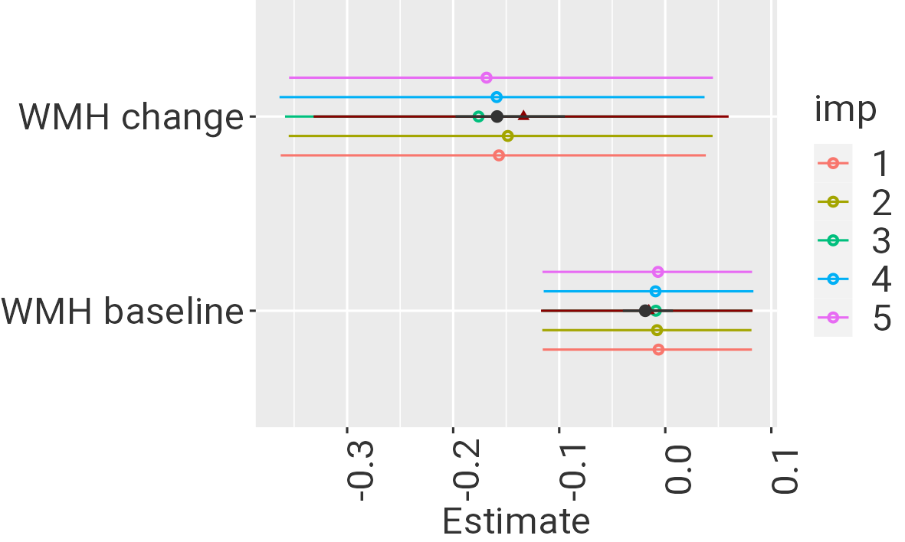
```
```{r model assumptions M3, eval=T}
n_infl=list()
stall=list()
coefs=list()
rob=list()
conf=list()
for (i in c(1:5)){
  n_infl=rbind(n_infl,read.csv(paste0(outdir_assumptions, "model_M3_globalcog//infl_cases_M3_globalcog_imp_",i,".csv")))
  coefs=rbind(coefs,read.csv(paste0(outdir_assumptions, "model_M3_globalcog//coeffs_wo_infl_M3_globalcog_imp_",i,".csv")))
  conf=rbind(conf,read.csv(paste0(outdir_assumptions, "model_M3_globalcog/M3_globalcog_imp_",i,".csv")))
  stall=rbind(stall,read.csv(paste0(outdir_assumptions, "model_M3_globalcog/stabmodel_M3_globalcog_imp_",i,".csv")))
  rob=rbind(rob,read.csv(paste0(outdir_assumptions, "model_M3_globalcog/robustmodel_M3_globalcog_imp_",i,".csv")))
}

n_infl_cog=n_infl
#Summarize stability results (min max across imputations)
stall$imp=as.factor(rep(c(1:5), each=nrow(stall)/5))
stall_sum = stall%>%
  group_by(X) %>%  
  summarise(orig=mean(orig),
            min=min(min),
         max=max(max))

#create confidence intervals for results from influential cases
coefs$imp=as.factor(rep(c(1:5), each=9))
coefs = cbind(coefs, conf[c(3:11,14:22,25:33,36:44,47:55),])

rob_sum = rob%>%
  group_by(X) %>% 
  summarise(Estimate=mean(Estimate),
            min=min(X2.5..),
            max=max(X97.5..))

p<-ggplot(coefs[coefs$X=="asinh_wml_base"|
                 coefs$X=="asinh_wml_change",], aes(y = X, x = Estimate, xmin=X2.5.., xmax=X97.5..)) +
    geom_pointrange(aes(color = imp), shape=1, size=0.3,  position = position_dodge(width = .5)) + 
  geom_pointrange(aes(x=Estimate, xmin=min, xmax=max, y=X), shape=17, size=0.3, color=c("darkred"),   data=rob_sum[rob_sum$X=="asinh_wml_base"|rob_sum$X=="asinh_wml_change",]) +
  geom_pointrange(aes(x=orig, xmin=min, xmax=max, y=X), shape=16, size=0.5, color=c("grey20"), data=stall_sum[stall_sum$X=="asinh_wml_base"|
                 stall_sum$X=="asinh_wml_change",])+ 
  scale_y_discrete(labels=(c('WMH baseline', 'WML change')))+
  theme(axis.text.x = element_text(color = "grey20", size = 17, angle=90, family = "Roboto"),
        axis.title.y = element_blank(),
        axis.title.x = element_text(color = "grey20", size = 17, family = "Roboto"),
        axis.text.y = element_text(color = "grey20", size = 17, family = "Roboto"),
        legend.title = element_text(color = "grey20", size = 17, family = "Roboto"),
        legend.text = element_text(color = "grey20", size = 17, family = "Roboto"),
        plot.margin = margin(t = 0,  # Top margin
                             r = 0,  # Right margin
                             b = 0,  # Bottom margin
                             l = 0,  # Left margin
                             unit = "cm"))

ggsave(
  "figures/Assumptions_M3.png", 
  p, 
  device = agg_png, 
  width = 10, height = 6, units = "cm", res = 300,
  scaling = 0.7
)

```

```{r showassuM3, echo=FALSE,out.width="90%",out.height="80%",fig.cap="Global cognition models: Original estimate (black) with minimum and maximum value derived from stability analysis (black line) and estimates derived from models excluding 13 influential cases (colours).",fig.show='asis', results='asis',fig.align='center'}
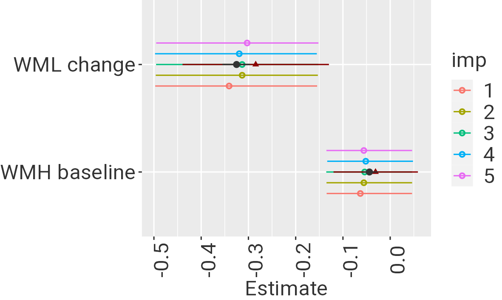
```

Residuals and random effects were normally distributed for all models (see Supplementary Material).  All VIF were below 10. \
There were `r length(unique(n_infl_m1$x))`, `r length(unique(n_infl_ex$x))` and `r length(unique(n_infl_cog$x))` unique influential cases across the five imputations for model M1, M2 and M3, respectively.
Figures \@ref(fig:showassuM1), \@ref(fig:showassuM2) and \@ref(fig:showassuM3) show original estimates, minimal and maximal estimates from random effect stability tests across imputations, robust LMM estimate and 95% CI and estimates and 95% CI from models without influential cases for each imputed dataset. \
In M1, estimates for WHR change came with high uncertainty while all other estimates agreed well between the original model and models without influential cases, individual random effects and robust LMM. \
In Model M2, influential cases biased the estimates towards higher values for WML change. Robust estimates showed a similar trend. \
In Model M3, this bias for WML change was smaller. Still, the robust estimates were somewhat smaller than the original ones.


\newpage

# Discussion
In this registered report, we studied the progression of WMH with respect to risk factors and cognitive outcomes. We pre-registered three confirmatory hypotheses of which one was accepted. We found a significant association of WMH progression and global cognitive decline over 6 years. There was no significant effect of baseline DBP on WMH progression nor an association of WMH progression and executive function decline, with Bayes Factors indicating inconclusive results. \
In exploratory analyses, we found that increase in DBP was a significant predictor of WMH progression, independent of baseline DBP. WHR at baseline or change in WHR did not predict WMH progression. SBP at baseline and increase of SBP also predicted WMH progression. There was no significant interaction with gender for any of the effects. Descriptively, women had higher WMH volume than men and performed better in executive function and global cognitive function at baseline. \
```{r robustlmm, cache=T}
i=1
comp_imp=mice::complete(imp, "long")
tmp=comp_imp[comp_imp$.imp==i,]
tmp = tmp %>% group_by(subj) %>%
  mutate(wml_base = ifelse(time == "bl", wml, lag(wml)),
                     wml_change = ifelse(time == "bl", 0, wml - wml_base))%>%
  mutate(wml_change_y = ifelse(time == "bl", 0, wml_change/age_change))             


res <- robustlmm::rlmer(formula = 'globalcog ~ age_base + age_change +
                                 wml_base  + wml_change +
                                 sex + education + cesd + TIV + (1|subj)',
                            data=tmp)
summary(res)
median(tmp$wml_base)
median(tmp[tmp$time=="fu","wml_change_y"]$wml_change_y)

res0 <- robustlmm::rlmer(formula = 'globalcog ~ age_base + age_change +
                                 sex + education + cesd + TIV + (1|subj)',
                            data=tmp)
summary(res0)


```
The mean annual WMH progression in this study was `r round(mean(tmp[tmp$time=="fu","wml_change_y"]$wml_change_y),2)` cm3/y. This was comparable to the estimation in our power analysis (0.32 cm3/y) but lower than the figure reported by @brown21 (0.7 cm3/y) who also included stroke and dementia patients. 
Against our hypotheses, we did not find an interaction effect of baseline DBP with time since baseline on the progression of WMH. Previous studies mostly investigated annual change in WMH volume as outcome in a linear model, while we took the more flexible approach of using a mixed model. Both approaches should yield equivalent results (@walker18). In additional analyses, we found stronger effects of both baseline and change in DBP when using annual change in WMH volume as outcome in a linear model like in @debette11 (both p<10⁻5). However, these models did not satisfy the assumptions of the linear model (non-normal distribution of residuals), possibly due to the zero-inflated and left-bounded distribution of WMH change (see Supplementary Figure). When using change based on asinh-transformed WMH volumes at baseline and followup as outcome in a linear model, the association of baseline DBP with WMH change was reduced. \
In our confirmatory analysis, we found higher DBP increase related to increase in WMH volume, independent of baseline DBP. This was seen in both the preregistered mixed model analysis and in the change score models. Additionally, in an exploratory analyses, we found that both higher SBP at baseline and increase in SBP were associated with WMH progression in line with the literature. \
DBP reflects the balance between peripheral vascular resistance and large artery stiffness while SBP increases with both vascular resistance and large artery stiffness (@pinto07). In the course of aging, SBP and DBP increase in parallel, driven by both vascular resistance and large arterial stiffness until around 55 years. After that, large artery stiffness dominates and leads to further increases of SBP while DBP levels off or slightly decreases (@kaess12; @franklin97). Previous studies have stressed the stronger association of concurrent SBP with WMH volume in the elderly, and a stronger effect of mid-life DBP on WMH in late-life (@wartolowska21). While this was a cross-sectional study, our results supported the stronger effect of baseline SBP compared to baseline DBP but similar effects of BP change (@wilkinson22). \
Previous studies have focused on SBP reduction due to its strong age-related increase and greater importance for cardiovascular events in the elderly (@wang05). In the SPRINT-MIND trial, the intensive SBP group (mean after intervention of 120 mm Hg) vs the standard SBP control group (mean of 135 mm Hg) showed significantly less WMH progression (0.92 cm3 vs 1.45 cm3) (@nasrallahAssociationIntensiveVs2019). DBP also reduced in the main SPRINT trial but no data was reported in relation to WMH progression (@sprintresearchgroup15). Intensive BP control did not induce hypoperfusion in @croall18 but excessively low DBP might be associated with an increased risk for stroke and cardiovascular disease (@somes99). \
We did not find evidence for an association of abdominal obesity with WMH progression. Despite obesity being a risk factor for dementia, its association with imaging markers of cSVD is relatively small compared to hypertension (@arnoldussenAdiposityRelatedCerebrovascular2019; @dearbornObesityInsulinResistance2015;  @livingstonDementiaPreventionIntervention2020; @debette11). 
In line with previous studies, we found that WMH progression was associated with global cognitive decline (@hamilton21; @kloppenborgPresenceProgressionWhite2014). This association amounted to a reduction of `r round(summary(res)$coefficients["wml_change","Estimate"],3)` in the normalized global cognition score per 1 cm3 of WMH volume increase (while adjusting for age and time elapsed). A year elapsed accounted for `r round(summary(res0)$coefficients["age_change","Estimate"],3)` decrease in global cognition, or `r round(summary(res)$coefficients["age_change","Estimate"],3)` when simultaneously adjusting for WMH change. \
We did not find a statistically significant evidence of an association for executive function, yet the estimate was negative as expected and the BF of 0.86 indicated that no conclusive evidence could be drawn. Yet, the notion that WMH predominantly affect executive function dependent on frontal brain networks was not supported by our data which is rather in line with a more universal negative effect of WMH volume on cognitive function (@hamilton21). \
We did not find any gender-specific associations of risk factors or cognitive outcomes with WMH progression. While females had higher WMH volumes at baseline, progression was similar in line with previous studies (@lohner22;@brown21). We could not provide evidence for a differential association of cardiovascular risk factors and WMH progression between genders as suggested in (@alqarni20; @sachdev09). These studies, however, mostly investigated cross-sectional WMH volume and did not investigate the interaction of risk factors, gender and time. Also regarding the cognitive consequences of WMH progression, no differences between genders were seen. Still, we cannot rule out that we were underpowered to detect these effects. \
Finally, in an exploratory analysis of spatial patterns of WMH, we found that WMH progression mainly occurred in the frontal and parietal WM, from the ventricles towards deeper WM areas. This is in line with previous reports of gradual extension of existing WMH into nearby normal appearing WM (@promjunyakulBaselineNAWMStructural2018). We found that in those with stronger DBP increases, frontal-parietal WMH expanded more. There was no DBP or WHR-associated increase in any other spatial patterns. Specifically, component 4 which included occipital-juxtacortical WMH which might be reflective of cerebral amyloid angiopathy did not change in relation to the risk factors and was overall relatively stable (@thanprasertsuk14; @charidimou22). \
Taken together, these results indicate that strict control of DBP in both men and women is recommended in order to limit WMH progression and related global cognitive decline. 

\newpage
# References